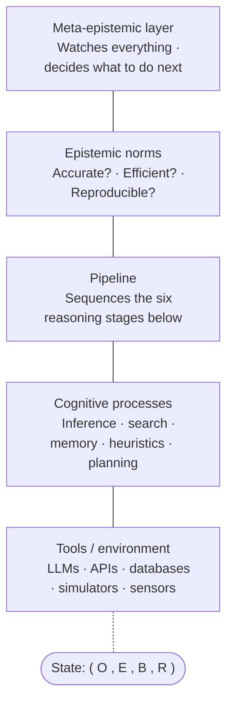
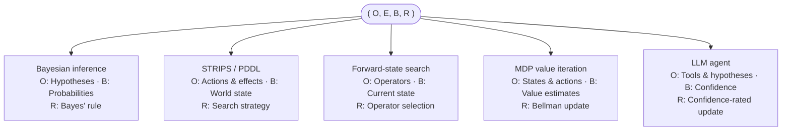

# Epistemic Pipeline

> **Status: v1.1 implemented.** Five reasoning frameworks run on the full pipeline — Bayesian inference, STRIPS planning, forward-state search, MDP value iteration, and an LLM-agent loop — each with norm scoring, an adaptive meta-layer, JSONL trace persistence, and the `epc` CLI. A sixth encoding, worldview, is in progress: a Subjective Logic upgrade to how it revises beliefs.

A formal system for making reasoning explicit and auditable. It tracks four things: the vocabulary of a problem, what has been observed, how confident the system is in each hypothesis, and the rule it uses to update that confidence.

**Who is this for?** Researchers and engineers who build systems that reason — and need to inspect, replay, and evaluate that reasoning after the fact.

[Formal specs (index)](docs/superpowers/specs/) · [Current design (v1.1)](docs/superpowers/specs/2026-05-14-epistemic-pipeline-v11-design.md)

Python 3.14+ | Zero dependencies | MIT License

---

## The Idea

Many reasoning systems — human or artificial — can be modeled as four operations:

1. **Define an ontology** for the problem → what concepts exist?
2. **Gather evidence** → what has been observed?
3. **Hold beliefs** → how confident is the system in each hypothesis? A belief here is graded — a number between 0 and 1 that represents a degree of confidence. 0 means "certainly false." 1 means "certainly true." 0.6 means "more likely than not."
4. **Revise those beliefs** when new evidence arrives → how does the system update?

This project makes those four operations explicit:

| | Component | What it is | Example |
|:-:|-----------|-----------|---------|
| **O** | Ontology | The concepts, types, and constraints of the problem | `diseases: [flu, cold, covid]` / `symptoms: [fever, cough, loss_of_smell]` |
| **E** | Evidence | What has been observed | `[fever=true, cough=true, loss_of_smell=true]` |
| **B** | Beliefs | A graded degree of confidence in each hypothesis (0 = impossible, 1 = certain) | `{flu: 0.10, cold: 0.02, covid: 0.88}` |
| **R** | Revision | The rule for updating beliefs | Bayes' rule, search algorithms, or Bellman updates — your choice |

**R is the key — but not the only thing that changes.** Different reasoning frameworks reinterpret all four components:

- Set R to **Bayes' rule** → probabilistic reasoning. Bayes' rule is the standard formula for updating confidence when new evidence arrives. O defines hypotheses and observations. E is observed data. B is a probability distribution (a set of numbers that sum to 1, one per hypothesis).
- Set R to a **search algorithm** → planning. A search algorithm explores possible paths through a space of options to find one that reaches a goal. O describes actions and their effects. E records which states have been visited. B tracks the current world state.
- Set R to a **Bellman update** → decision-making. A Bellman update is the core formula from reinforcement learning: it computes the value of a state by combining the immediate reward with the expected value of future states. O defines states and actions. E provides observed rewards. B holds value estimates.

The tuple `(O, E, B, R)` is a state machine. A state machine is a system with a defined state that changes according to fixed rules. O is read-only. E is append-only. B is the mutable state. R is the transition function you plug in. That generality is deliberate. The hard question is not *can* a framework be encoded, but *does the encoding preserve what matters about it*.

---

## Why This Matters

Many AI systems produce outputs without tracking how they got there. Logging tools record *what happened*. Experiment trackers record *which run produced which result*. Neither records *why*. They don't capture the epistemic state that led to each decision. Epistemic state means what the system believed and why.

This design records the why. Every state is immutable. Once created, it never changes. Every transition is a pure function. Pure means same inputs always produce the same outputs, with no side effects. The system preserves the full trace of epistemic states. You can always answer:

> *What did the system believe at each step, and what rule did it use to change its mind?*

---

## API Example

```python
from epistemic_pipeline.encodings.bayes import BayesProblem, run_bayesian_pipeline
from epistemic_pipeline.state import Observation

# Define the problem: hypotheses, observables, likelihoods, evidence, priors.
problem = BayesProblem(
    hypotheses=("flu", "cold", "covid"),
    observables=("fever", "cough", "loss_of_smell"),
    # Likelihoods: P(value | disease, symptom). Each key is (disease, symptom, value).
    # ("flu", "fever", "yes"): 0.8 means "given flu, an 80% chance of fever."
    likelihoods={
        ("flu",   "fever", "yes"): 0.8,   ("flu",   "cough", "yes"): 0.7,  ("flu",   "loss_of_smell", "yes"): 0.05,
        ("cold",  "fever", "yes"): 0.3,   ("cold",  "cough", "yes"): 0.9,  ("cold",  "loss_of_smell", "yes"): 0.02,
        ("covid", "fever", "yes"): 0.85,  ("covid", "cough", "yes"): 0.8,  ("covid", "loss_of_smell", "yes"): 0.7,
    },
    # Evidence, processed in order during the Test stage.
    observations=(
        Observation(variable="fever",         value="yes", source="exam", timestamp=1.0),
        Observation(variable="cough",         value="yes", source="exam", timestamp=2.0),
        Observation(variable="loss_of_smell", value="yes", source="exam", timestamp=3.0),
    ),
    # Priors — the starting confidence before any symptoms. Must sum to 1.
    priors={"flu": 0.4, "cold": 0.4, "covid": 0.2},
)

# Run the full pipeline. Each stage is a pure function: state in, state out.
result = run_bayesian_pipeline(problem)

print(result.final_state.beliefs.probabilities)
# → {flu: 0.10, cold: 0.02, covid: 0.88}

# Every stage's state is preserved in result.trace. Beliefs update in the
# Test stage, which applies all the evidence.
for i, state in enumerate(result.trace):
    print(f"Step {i}: {state.beliefs.probabilities}")
# → Step 0: {flu: 0.40, cold: 0.40, covid: 0.20}   (Frame: priors)
# → Step 4: {flu: 0.10, cold: 0.02, covid: 0.88}   (Test: after all evidence)
```

Three symptoms in. One diagnosis out. Every step recorded and replayable.

Note: the model assumes symptoms are conditionally independent given the disease. Conditional independence is a simplifying assumption. It means each symptom's probability depends only on the disease, not on whether other symptoms are present. This is the "naive Bayes" simplification. Real medical diagnosis is more complex. This keeps the example clear.

### Writing Your Own Revision Policy

R is the part you swap. Every revision policy implements one method:

```python
class MyRevision:
    def __call__(self, beliefs: B, evidence: e, ontology: O) -> B:
        # Take current beliefs, one new observation, and the ontology.
        # Return updated beliefs. No side effects.
        ...
```

`bayes_update` applies Bayes' rule inside this interface. It is a plain function, not a class — any callable with this signature works. A planning revision would apply an action to a world state. The interface stays the same.

---

## The Architecture

Two views of one system. The **stack** describes what kinds of modules exist. Five layers, from low-level tools up to self-monitoring. The **tuple** describes what changes as reasoning progresses. The four data structures that make up the system's state at any moment.



The pipeline layer runs six stages in order. Each stage is a pure function — state in, state out:


Each layer reads and writes different parts of the state tuple:

| Layer | O | E | B | R |
|-------|---|---|---|---|
| **Tool / Environment** | provides | **produces** | — | — |
| **Cognitive Process** | reads | reads | **transforms** | — |
| **Pipeline** | sequences | sequences | sequences | — |
| **Norms** | evaluates | evaluates | evaluates | evaluates |
| **Meta-Epistemic** | re-frames | requests more | forces revision | **modifies** |

---

## What Ships Today

- Deterministic state machine implementing `(O, E, B, R)`
- Five expressiveness demonstrations: Bayesian inference, STRIPS planning, forward-state search, MDP value iteration, and an LLM-agent loop
- Full state trace, norm scoring, adaptive meta-layer with intervention budget and cycle detection. Norm scoring means evaluating the quality of the reasoning process, not just its output.
- Trace persistence as JSONL, plus the `epc` CLI to replay, diff, and score saved traces
- Tool/LLM integration layer
- A worldview encoding, with a Subjective Logic upgrade to its revision rule in progress
- No external dependencies. Pure Python.

An "expressiveness demonstration" shows that a well-known reasoning framework fits into this architecture as one configuration. It shows the encoding preserves the framework's essential properties, not just its inputs and outputs. What counts as "essential" depends on the framework. For Bayesian inference: the posterior credences must match what Bayes' rule produces. A posterior is the updated confidence after seeing the evidence.

The formal specs live in [`docs/superpowers/specs/`](docs/superpowers/specs/). The code lives in [`src/epistemic_pipeline/`](src/epistemic_pipeline/). The specs define the interfaces. The code implements them.

---

## Expressiveness Demonstrations

Five frameworks, each encoded as `(O, E, B, R)` — plus a worldview encoding in progress:



| | Framework | What it is | What it tests | R becomes | Status |
|:-:|-----------|-----------|---------------|-----------|--------|
| **v0.1** | Bayesian inference | The standard math for updating confidence from evidence | Probabilistic reasoning | Bayes' rule | Done |
| **v0.2** | STRIPS / PDDL | A formal language for describing planning problems: what actions exist, what they require, and what they change | Goal-directed planning. All four components (not just R) get reinterpreted: B becomes world state, E becomes action history | Search strategy | Done |
| **v0.2** | Forward-state search | Exploring a space of possible states toward a goal | General problem solving | Operator selection | Done |
| **v1.0** | MDPs | Markov Decision Processes. A mathematical framework for choosing actions when outcomes are uncertain and future consequences matter | Decision-making under uncertainty | Bellman updates | Done |
| **v1.1** | LLM agent | A program that calls a language model in a loop, often with tools, to answer a question | Tool-using agents, with graded confidence over hypotheses | Confidence-rated update | Done |
| **next** | Worldview | Tracking graded beliefs about claims as new documents arrive | Belief revision over a worldview, without forgetting on omission | Subjective Logic fusion | In progress |

The tuple is general enough to encode most things. Any computation can be described as a state machine. That is not the interesting claim. The interesting claim is different. Decomposing state into O, E, B, and R captures epistemically relevant structure that a generic state machine does not. The access-control pattern in the layer table above matters. The real test is whether each encoding preserves what makes its framework distinct.

---

## Quick Start

```bash
uv pip install -e .        # install the package locally
uv run pytest              # run the test suite
uv run pyright             # run the type checker
```

Once you have a saved trace (`epistemic_pipeline.trace.dump_trace`), the `epc` CLI inspects it:

```bash
uv run epc replay trace.jsonl       # walk the trace step by step
uv run epc diff a.jsonl b.jsonl     # show the first step where two traces diverge
uv run epc score trace.jsonl        # score the run on reliability, efficiency, justification, power
```

---

## Project Structure

```text
epistemic-pipeline/
├── docs/superpowers/specs/         Current design specs (start at README.md)
├── docs/research/                  Active research notes (worldview / Subjective Logic)
├── research/                       Agent-debugging use case + sample traces
├── archive/                        Superseded specs, plans, and early research notes
├── src/epistemic_pipeline/         Reference implementation
├── tests/                          pytest suite
└── pyproject.toml
```

---

## Related Work

This project draws on several traditions. It doesn't replace any of them.

**Belief revision theory.** The [AGM framework](https://plato.stanford.edu/entries/logic-belief-revision/) defines axioms for rational belief change over logically closed belief sets. A logically closed set contains every consequence of its beliefs. If it believes "all dogs are mammals" and "Rex is a dog," it also believes "Rex is a mammal." AGM operates on belief sets. You believe something or you don't. Our R operates on credences. Credences are degrees of confidence. These are different epistemic attitudes. The bridge between them is itself an active area of research. Showing that AGM's postulates hold under our encoding is an open task.

**Jeffrey conditionalization.** Standard Bayes' rule assumes the evidence is certain. You either observed the symptom or you didn't. Jeffrey conditionalization generalizes this to uncertain evidence. Richard Jeffrey introduced this in *The Logic of Decision* (1965). For example: "I'm 70% sure I saw a fever." Our v0.1 assumes certain evidence. Supporting uncertain evidence through Jeffrey conditionalization is a natural extension.

**Goldman's reliabilism.** Goldman's [*Epistemology and Cognition*](https://www.hup.harvard.edu/books/9780674258969) (1986) argues that a belief is justified if the process that produced it reliably tracks truth across many cases. Not just one. Our Norms layer draws on this idea. But our v0.1 "accuracy" norm is a single-run correctness check. A starting point, not Goldman's full theory. We use the term "epistemic norms" broadly to include accuracy, efficiency, and reproducibility. In philosophy, epistemic norms typically refer to norms governing belief. Coherence, calibration. Our usage extends to computational and methodological criteria.

**Cognitive architectures.** [ACT-R](http://act-r.psy.cmu.edu/) and [SOAR](https://soar.eecs.umich.edu/) model human cognition with detailed memory, timing, and learning mechanisms. ACT-R integrates declarative memory and procedural memory with activation-based retrieval. Declarative memory stores facts. Procedural memory stores learned skills. Activation-based retrieval means memories that have been used recently or frequently are easier to recall. SOAR models goal-directed problem solving through impasse resolution and chunking. Impasse resolution detects when the system doesn't know what to do next. Chunking automatically learns from solved impasses so the same problem is faster next time. Our 5-layer stack is modular in a software-architecture sense. It separates concerns into layers. ACT-R and SOAR are modular in a cognitive sense. They separate the mind into interacting subsystems. This project is a computational framework, not a cognitive model. It lacks their empirical grounding and makes no claims about how humans actually think.

**Probabilistic programming.** Languages like Pyro, Stan, and WebPPL bundle models, data, and inference into one framework. A probabilistic programming language lets you write a statistical model as code. It then automatically infers the parameters that best explain your data. These tools handle continuous parameters, hierarchical models, and advanced sampling methods. Our architecture aims to be inference-method-agnostic. R can be Bayesian, but also search or decision-theoretic. The pipeline and norms layers have no direct equivalent in PPLs. PPLs have their own diagnostics. Convergence checks, model comparison.

**Epistemic integrity in AI.** [*Beyond Prediction*](https://arxiv.org/html/2506.17331) (preprint, 2025) proposes an architecture where AI agents justify beliefs under formal constraints using Kripke semantics. Kripke semantics models knowledge across possible worlds. It asks not just "what do I believe?" but "what would I believe in every situation consistent with what I know?" Similar goals to this project, different formalism.

**What this project does not cover.** Goals and motivation (central to SOAR and human cognition). Attention and salience. Salience means which information to focus on. Dual-process reasoning. Kahneman's distinction between fast, automatic judgment (System 1) and slow, deliberate analysis (System 2). Bounded rationality. Simon's insight that real reasoners have limited time and memory. Gigerenzer's related but distinct argument that simple heuristics can outperform optimization by exploiting the structure of the environment. Learning across runs. The system's revision policy R is fixed. It does not improve from experience the way ACT-R's production compilation and SOAR's chunking do. Online metacognitive monitoring. Active inference. Friston's framework where perception and action are both forms of prediction-error minimization. These reflect scope decisions for v0.1, not claims that they don't matter.

**What's new here.** Few frameworks separate ontology, evidence, beliefs, and revision into a typed, immutable state tuple that preserves every trace. Fewer score each run against epistemic norms. The norm-scoring layer is the most distinctive feature — but v0.1 implements only a simple accuracy check. Richer norms (calibration, coherence, efficiency of evidence use) are needed to demonstrate real value. Is this genuinely illuminating, or just a relabeling of generic state machines? The expressiveness demonstrations must answer that. Each encoding must preserve what makes its framework distinct — and the criteria for "preserves" must be stated precisely for each one.
