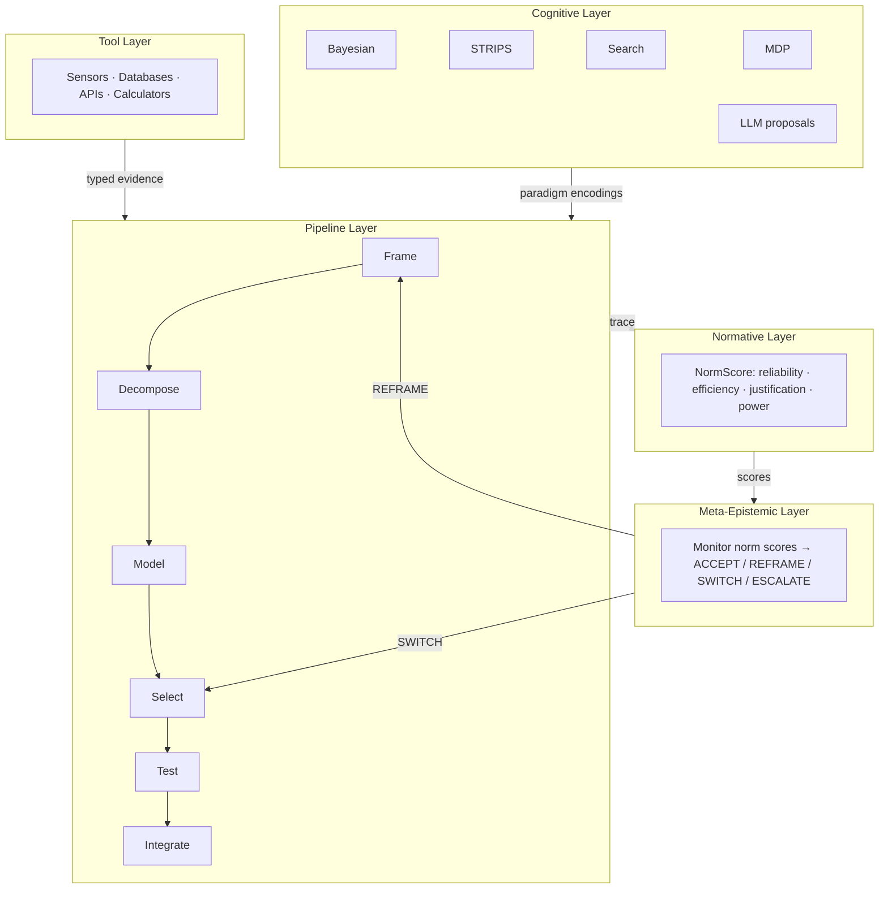
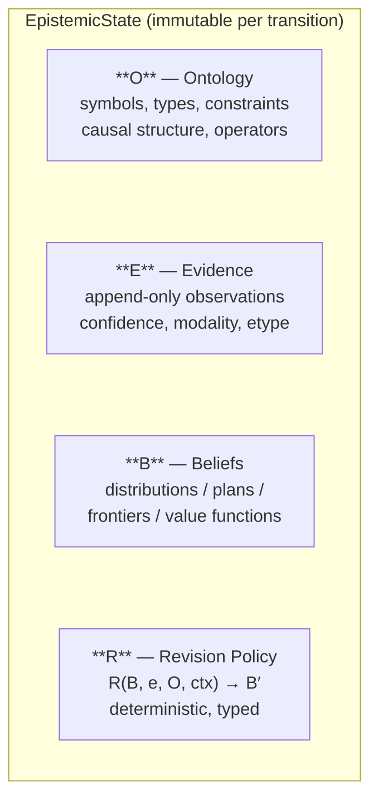
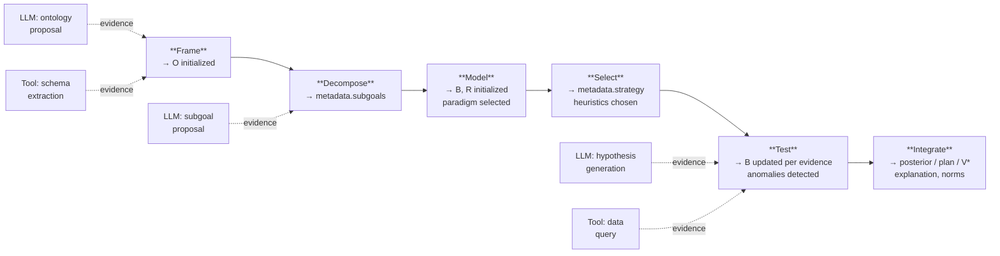
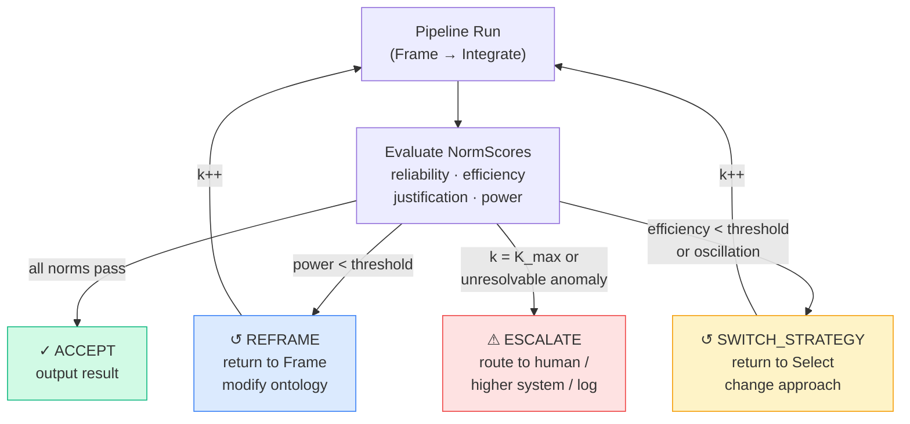
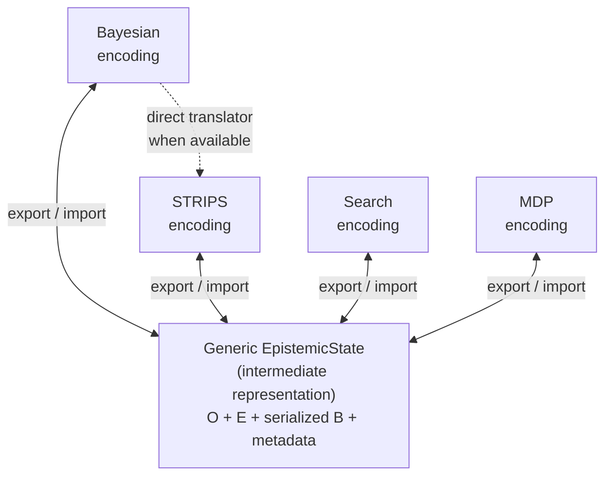
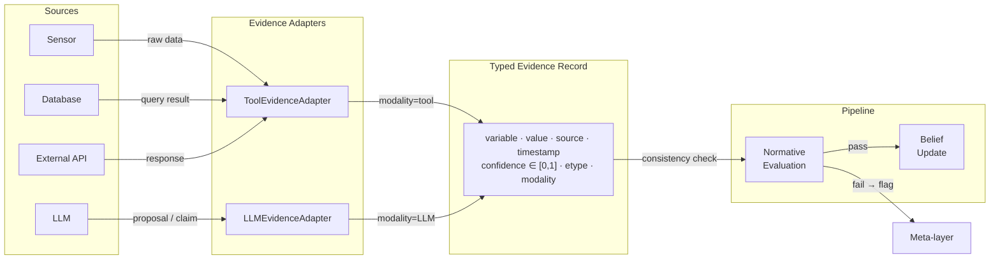

# The Epistemic Pipeline: A Deterministic, Multi‑Paradigm Architecture for Structured Reasoning

**Authors:** William + Copilot (as assistant)

---

## Abstract

This work introduces the *Epistemic Pipeline*, a deterministic, multi-paradigm reasoning architecture designed to unify symbolic, probabilistic, and learned cognitive processes within a single, auditable framework. The system formalizes reasoning as a sequence of pure transformations over an epistemic state tuple $(O, E, B, R)$, where the ontology $O$, evidence $E$, beliefs $B$, and revision policy $R$ evolve through a six‑stage pipeline: Frame, Decompose, Model, Select, Test, and Integrate. Each stage is deterministic, replayable, and fully typed, enabling transparent inspection of intermediate states and complete trace reconstruction.

The architecture supports multiple reasoning paradigms through interchangeable encodings of the epistemic state. We demonstrate expressiveness across four domains: Bayesian inference, STRIPS planning, state‑space search, and Markov decision processes. These encodings share a common interface and can be dynamically selected or switched at runtime. A meta‑epistemic control layer monitors reliability, efficiency, justification, and representational power, enabling adaptive strategy selection, ontology reframing, and paradigm switching in response to anomalies such as oscillation, contradiction, or causal inconsistency.

Version 1.0 extends the deterministic core with controlled integration of external tools and large language models. Tools provide structured, typed evidence; LLMs act as proposal generators for ontology construction, task decomposition, strategy selection, and explanation synthesis. All external contributions are treated as evidence with explicit modality and are evaluated by the normative layer before incorporation into the epistemic state.

The result is a general‑purpose reasoning engine that is transparent, modular, and verifiably correct. It supports multi‑paradigm inference, adaptive meta‑control, and hybrid symbolic‑statistical cognition while preserving determinism and auditability. This architecture provides a foundation for building reliable autonomous systems, interpretable AI agents, and domain‑agnostic cognitive frameworks capable of operating across complex real‑world tasks.

---

## 1 Introduction

Modern AI systems excel at pattern recognition but struggle with transparent, reliable reasoning. Symbolic systems offer structure and interpretability but lack the flexibility to handle uncertain or incomplete information. Probabilistic systems offer principled uncertainty modeling but struggle to represent complex symbolic structure. Large language models offer fluency and breadth of knowledge but lack determinism, auditability, and formal correctness guarantees. No existing architecture unifies these strengths while mitigating their weaknesses.

The fragmentation of reasoning paradigms has persisted for decades. Classical AI planning operates within formal symbolic frameworks that cannot natively represent graded uncertainty. Bayesian inference handles uncertainty with mathematical rigor but assumes that the relevant variables and their relationships are already known. Reinforcement learning discovers optimal policies through interaction but produces opaque value functions that resist introspection. And the recent wave of LLM-based agent systems, while impressively flexible, operates through stochastic text generation that cannot guarantee identical outputs on repeated runs, cannot produce formally verifiable reasoning traces, and cannot distinguish between knowledge, belief, and conjecture.

This paper introduces the *Epistemic Pipeline*, a deterministic reasoning architecture that integrates symbolic, probabilistic, and learned cognitive processes into a single, auditable system. The pipeline is built around a typed epistemic state — a formal tuple $(O, E, B, R)$ capturing the system's ontological commitments, accumulated evidence, current beliefs, and revision policy — and a sequence of pure transformations that evolve this state through six stages of structured reasoning. A meta-epistemic control layer monitors reasoning quality using normative criteria and dynamically adjusts strategies, ontologies, and paradigms when reasoning degrades.

The architecture makes three key design commitments. First, *conditional determinism*: the pipeline's internal reasoning is implemented as pure functions over immutable state, guaranteeing that given identical inputs — including any recorded external contributions — the pipeline produces identical outputs. When LLMs or tools are invoked, their outputs are recorded as part of the evidence trace; replay determinism is conditioned on this recorded trace rather than on re-invoking the external source. This distinction is important: the system provides *architectural determinism* (the reasoning engine itself is a pure function) rather than *environmental determinism* (external sources may behave differently on re-query). Second, *paradigm neutrality*: the epistemic state model accommodates Bayesian inference, symbolic planning, heuristic search, and decision-theoretic reasoning through interchangeable encodings that share a common interface. Third, *epistemic discipline*: all information entering the system — whether from sensors, tools, or LLMs — is treated as typed evidence with explicit confidence and modality, subject to normative evaluation before influencing beliefs.

### 1.1 Contributions

This work contributes:

1. **A unified epistemic state model** that supports symbolic, probabilistic, and learned representations through a typed tuple $(O, E, B, R)$ with formal invariants governing consistency and adequacy.

2. **A deterministic six-stage pipeline** — Frame, Decompose, Model, Select, Test, Integrate — composed as pure functions over immutable epistemic states, guaranteeing architectural determinism and trace-conditioned replayability.

3. **A normative evaluation layer** that quantifies reasoning quality across four dimensions: reliability (correctness and calibration), efficiency (computational cost), justification (causal support and replayability), and representational power (ontological and paradigm adequacy).

4. **A meta-epistemic controller** that monitors norm scores and triggers adaptive interventions — reframing ontologies, switching strategies, changing paradigms, or escalating anomalies — based on formally specified decision logic.

5. **A multi-paradigm expressiveness suite** demonstrating that Bayesian inference, STRIPS planning, state-space search, and Markov decision processes can all be expressed as specializations of the epistemic state model, sharing a common pipeline interface.

6. **Controlled integration of tools and LLMs** as typed evidence sources, where LLM outputs are treated as proposals subject to normative evaluation rather than as trusted actions.

The architecture is accompanied by a separate implementation specification (code skeleton with module structure, class hierarchies, and function signatures) sufficient to reconstruct the full system; the present paper focuses on the architectural design, formal properties, and expressiveness results.

### 1.2 Overview of the Architecture

The Epistemic Pipeline is organized into five layers operating over the shared epistemic state tuple $(O, E, B, R)$:



The state tuple flows horizontally through the pipeline stages while the meta-layer provides vertical feedback, creating a controlled loop between execution and reflection. The Tool Layer provides evidence; the Cognitive Layer provides paradigm encodings and LLM proposals; the Pipeline Layer orchestrates the six-stage reasoning flow; the Normative Layer evaluates reasoning quality; and the Meta-Epistemic Layer intervenes when quality degrades.

---

## 2 Background and Related Work

The Epistemic Pipeline draws on and synthesizes contributions from five major research traditions: classical AI planning and search, probabilistic reasoning and belief revision, cognitive architectures, modern LLM-based agent systems, and neurosymbolic AI. This section surveys the foundational and recent work in each domain, identifies the structural gaps that motivate the present architecture, and positions the Epistemic Pipeline relative to the closest existing systems.

### 2.1 Classical AI: Planning, Search, and Sequential Decision-Making

The formal foundations of AI planning begin with Fikes and Nilsson's STRIPS (1971), which established the precondition-effect operator paradigm that remains central to all modern planners. STRIPS encoded world models as first-order predicate calculus formulas and operators as add/delete-list transformations — a clean separation of state, actions, and goals that maps naturally to pipeline architectures. The subsequent standardization through PDDL (McDermott et al., 1998) and its extensions created the common language of the planning community and enabled systematic comparison through the International Planning Competition.

Hierarchical Task Networks extended classical planning with structured domain knowledge. Erol, Hendler, and Nau (1994–1996) formalized HTN planning and proved its expressivity strictly exceeds STRIPS. The SHOP/SHOP2 planners (Nau et al., 1999, 2003) demonstrated practical HTN planning, and HTN's decomposition of compound tasks into primitives via methods mirrors human task decomposition — a principle directly reflected in the Epistemic Pipeline's Decompose stage. GraphPlan (Blum & Furst, 1997) introduced the planning graph data structure with mutual exclusion constraints, demonstrating that encoding constraint information before search dramatically improves efficiency.

Modern planning systems have embraced modular, multi-stage processing. Fast Downward (Helmert, 2006) translates PDDL into the SAS+ formalism before search, establishing the translation-pipeline paradigm. The Epistemic Pipeline's multi-stage approach is spiritually similar — both systems decompose reasoning into translation, representation selection, and search — but the analogy should not be overstated: Fast Downward's pipeline is optimized for a single paradigm (classical planning) with decades of engineering behind its heuristic implementations, while the Epistemic Pipeline trades paradigm-specific optimization for multi-paradigm generality. The LAMA planner (Richter & Westphal, 2010) demonstrated that combining multiple heuristic information sources yields superior performance — a principle that motivates the Epistemic Pipeline's support for multi-strategy ensembles within a single paradigm.

State-space search provides the algorithmic backbone. The A* algorithm (Hart, Nilsson, & Raphael, 1968) defined the evaluation function $f(n) = g(n) + h(n)$ and proved optimality under admissible heuristics — properties essential for any deterministic reasoning pipeline requiring formal correctness guarantees. IDA* (Korf, 1985) achieved the same guarantees with linear memory, while pattern databases (Culberson & Schaeffer, 1996) exemplified precomputation-accelerated search. Monte Carlo Tree Search (Coulom, 2006; Kocsis & Szepesvári, 2006) introduced principled exploration-exploitation balancing via UCT, later combined with deep networks in AlphaGo (Silver et al., 2016) and AlphaZero (Silver et al., 2017).

The MDP and reinforcement learning tradition provides the formal framework for sequential decision-making under uncertainty. Bellman's dynamic programming (1957) established the principle of optimality and the Bellman equation. Puterman (1994) gave the definitive mathematical treatment of MDPs. POMDPs (Kaelbling, Littman, & Cassandra, 1998) formalized belief-state reasoning — maintaining probability distributions over hidden states — creating a natural bridge between probabilistic inference and planning. The reinforcement learning foundations laid by Sutton and Barto (1998, 2018), including temporal-difference learning, Q-learning (Watkins, 1989), and REINFORCE (Williams, 1992), enable learning optimal behavior without complete models.

Recent work (2023–2026) has begun bridging planning and LLMs. The LLM+P framework (Liu et al., 2023) uses LLMs to translate natural language into PDDL while classical planners solve for correctness. Corrêa, Pereira, and Seipp (2025) demonstrated LLM-generated heuristic functions that outperform domain-independent heuristics. Critically, Kambhampati et al. (2024) showed that pure LLM-based planning remains unreliable, establishing that external symbolic verification is essential — a finding that directly supports the Epistemic Pipeline's design of treating LLMs as proposal generators rather than trusted planners.

### 2.2 Probabilistic Reasoning and Belief Revision

The mathematical foundations of probabilistic reasoning trace from Bayes' theorem (1763) through Laplace's generalization (1812) to the modern subjective Bayesian framework. De Finetti (1937, 1974) established probabilities as personal degrees of belief and proved the exchangeability theorem. Cox's theorem (1946) derived the axioms of probability from desiderata of plausible reasoning, showing that any consistent system of uncertain reasoning must be isomorphic to probability theory. Jaynes (2003) extended this program with the Maximum Entropy principle, treating probability theory as extended logic — a philosophical position that supports probabilistic reasoning as a first-class component of any unified reasoning architecture.

Bayesian networks (Pearl, 1988) provided the representational formalism for structured probabilistic reasoning. Pearl's subsequent causal inference framework (2000, 2009) — structural causal models, do-calculus, counterfactual reasoning — bridges probabilistic and symbolic reasoning by formalizing how interventions differ from observations. The junction tree algorithm (Lauritzen & Spiegelhalter, 1988) enabled exact inference on general graphs, while factor graphs (Kschischang, Frey, & Loeliger, 2001) unified diverse message-passing algorithms under a single framework, enabling modular composition highly relevant to pipeline architectures.

Variational inference transformed probabilistic reasoning into optimization. Jordan et al. (1999) introduced variational methods to machine learning; stochastic variational inference (Hoffman et al., 2013) scaled to massive datasets; and automatic differentiation variational inference (Kucukelbir et al., 2017) eliminated the need for model-specific derivations. Probabilistic programming languages operationalized these ideas: Church (Goodman et al., 2008), Stan (Carpenter et al., 2017), Pyro (Bingham et al., 2019), Gen (Cusumano-Towner et al., 2019), and others provide flexible modeling and inference backends.

Belief revision theory provides the normative framework for rational knowledge change. The AGM framework (Alchourrón, Gärdenfors, & Makinson, 1985) established eight rationality postulates for belief revision, with Gärdenfors (1988) extending it through epistemic entrenchment orderings. Jeffrey conditionalization (Jeffrey, 1965) generalized Bayesian conditioning to uncertain evidence — essential for realistic updates where observations are graded rather than certain. Dempster-Shafer theory (Dempster, 1967; Shafer, 1976) introduced belief functions for representing ignorance and fusing evidence from heterogeneous sources. Ranking theory (Spohn, 1988, 2012) provides a qualitative alternative with superior handling of iterated revision. Darwiche and Pearl (1997) identified limitations of AGM for iterated revision and proposed additional postulates governing how revision interacts with underlying epistemic states.

Dynamic Epistemic Logic (Plaza, 1989; Baltag, Moss, & Solecki, 1998; van Ditmarsch, van der Hoek, & Kooi, 2007) models how agents' knowledge changes through actions. Epistemic planning (Bolander & Andersen, 2011; Muise et al., 2022) bridges formal epistemology and AI planning, achieving knowledge goals through action sequences. Recent work reconnects belief revision with modern AI: Hase et al. (2024) framed LLM model editing as belief revision, while Wilie et al. (2024) demonstrated LLMs' poor belief revision capabilities, motivating external architectures. A Graph-Native Cognitive Memory system (2026) applied AGM postulates to versioned knowledge graphs for AI agent memory.

The Epistemic Pipeline's revision policy $R(B, e, O, context) \rightarrow B'$ directly operationalizes the belief revision tradition, supporting both Bayesian conditioning and more general update operators within the same formal interface.

### 2.3 Cognitive Architectures

SOAR (Laird, Newell, & Rosenbloom, 1987), grounded in Newell's *Unified Theories of Cognition* (1990), established the production system paradigm with universal subgoaling — automatic hierarchical decomposition triggered by impasses — and chunking as a general learning mechanism. Modern Soar (Laird, 2012) incorporates reinforcement learning, semantic and episodic memory, and mental imagery. Recent LLM integration efforts include NL2GenSym (Yuan et al., 2025), which generates symbolic rules from natural language, and Wray, Kirk, and Laird (2025), who propose "LLM-Modulo" cognitive systems where LLM outputs are verified within the architecture — conceptually aligned with the Epistemic Pipeline's approach.

ACT-R (Anderson, 1983, 1993; Anderson et al., 2004) takes a hybrid symbolic-subsymbolic approach, with production rules operating over symbolic structures while subsymbolic processes — activation-based retrieval, spreading activation, utility learning — govern memory access and rule selection. Its Rational Analysis framework uses Bayesian-inspired principles for memory retrieval, representing the closest classical architecture approach to probabilistic reasoning. Recent developments include LLM-ACTR (Wu et al., 2025) and VSM-ACTR 2 (Wu et al., 2025), extending the architecture with metacognitive processes for strategy evaluation.

Among other architectures, CLARION (Sun, 2006, 2016) stands out for its dual-process theory with explicit and implicit representations and, crucially, a metacognitive subsystem — the MCS (Metacognitive Subsystem) — that monitors and regulates other cognitive processes through meta-level rules governing strategy selection, goal management, and learning control. CLARION's metacognitive subsystem is the closest precursor to the Epistemic Pipeline's meta-epistemic control, though it operates over fixed cognitive modules rather than formally tracked epistemic states and does not apply normative evaluation criteria derived from probability theory or belief revision postulates. LIDA (Franklin et al., 2006, 2014) implements Global Workspace Theory (Baars, 1988), where information achieves consciousness through competitive attention. Sigma (Rosenbloom et al., 2016) deserves particular attention: built on probabilistic graphical models (factor graphs with the summary product algorithm), it is the only classical cognitive architecture with native probabilistic reasoning, unifying symbolic and probabilistic processing from a single representational substrate. Sigma demonstrates that graphical-model-based unification is viable and partially addresses the multi-paradigm gap. However, Sigma does not integrate LLMs, does not provide formal normative evaluation of reasoning quality, and its meta-level control is embedded in the graphical model computations rather than operating as an explicit reflective layer. OpenCog Hyperon (Goertzel et al., 2023, 2026) represents the most ambitious multi-paradigm integration, combining Probabilistic Logic Networks, evolutionary learning, and neural networks via shared hypergraph knowledge representation.

The Common Model of Cognition (Laird, Lebiere, & Rosenbloom, 2017), synthesizing ACT-R, Sigma, and Soar, established a consensus architecture for cognitive systems. Recent extensions address metacognition (Laird et al., 2025) — reasoning over explicit representations of cognitive capabilities in working memory — though this proposal focuses on representing cognitive capacities rather than evaluating epistemic quality against formal norms. The CoALA framework (Sumers et al., 2024) draws explicit parallels between classical cognitive architectures and LLM agents, proposing a unified framework of memory (working + long-term), action space (internal + external), and decision-making procedures. CoALA's key insight — that LLMs can be viewed as learned production systems over natural language — directly informs the Epistemic Pipeline's treatment of LLMs as cognitive processes. However, CoALA remains a descriptive framework rather than a formal architecture: it identifies structural analogies but does not specify epistemic state models, revision policies, normative evaluation, or determinism guarantees.

A notable gap across all surveyed cognitive architectures is the absence of a formal learning mechanism in the Epistemic Pipeline's current design. SOAR learns through chunking, ACT-R through utility learning and activation adjustment, and CLARION through both top-down and bottom-up learning. The Epistemic Pipeline's v1.0 specification does not include a learning component — the system reasons but does not improve its reasoning over time. This is a deliberate scope limitation for the current version: the meta-layer's adaptive capabilities (reframing, strategy switching) provide within-run adaptation, but cross-run learning is deferred to future work (Section 11.3).

### 2.4 LLM-Based Systems

The LLM agent ecosystem has produced powerful but fundamentally non-deterministic systems. LLM tool use progressed from Toolformer (Schick et al., 2023), which taught self-supervised tool invocation, through Gorilla (Patil et al., 2023), which used retriever-aware training to reduce API hallucination, to commercial implementations including OpenAI function calling and structured outputs with JSON schema enforcement.

Structured reasoning frameworks represent the most sustained effort to improve LLM reasoning quality. Chain-of-thought prompting (Wei et al., 2022) demonstrated that intermediate reasoning steps improve performance, while self-consistency (Wang et al., 2022) improved results through majority voting. Tree of Thoughts (Yao et al., 2023) generalized CoT to tree-structured exploration with backtracking, and Graph of Thoughts (Besta et al., 2023) extended this to arbitrary graph structures enabling thought combination and refinement. Reasoning via Planning (Hao et al., 2023) integrated MCTS with LLM world models.

The reasoning model paradigm emerged with OpenAI's o1 (2024) and o3, which use RL to develop internal chain-of-thought, and DeepSeek R1 (January 2025), an open-source model trained with Group Relative Policy Optimization. These systems achieve impressive benchmarks but their reasoning traces are either hidden (o1/o3) or stochastic (R1) — neither deterministic nor formally auditable.

Agent frameworks proliferated rapidly: AutoGPT, BabyAGI, Microsoft AutoGen (Wu et al., 2023), LangChain/LangGraph, CrewAI, MetaGPT, and DSPy (Khattab et al., 2023). DSPy stands as the closest existing work to programmatic LLM control, abstracting pipelines as declarative text transformation graphs with compiler-optimized modules. DSPy's compiler optimizes prompts and few-shot examples through bootstrapping, achieving substantial performance gains — self-bootstrapped GPT-3.5 pipelines outperformed expert demonstrations by up to 46% in some benchmarks. The comparison to the Epistemic Pipeline is instructive: both systems treat LLM interactions as structured pipeline stages rather than ad hoc prompting, and both aim for reproducibility. However, DSPy optimizes statistically (maximizing a metric over a training set) rather than formally (maintaining epistemic invariants); it tracks module parameters (prompt templates, few-shot examples) rather than epistemic states (beliefs, evidence, revision policies); and it does not provide normative evaluation of reasoning quality, meta-level adaptive control, or paradigm switching. DSPy is best understood as a compiler for LLM pipelines; the Epistemic Pipeline is an architecture for epistemic reasoning that may use LLMs as one component.

RAG evolved from Lewis et al.'s (2020) original retrieval-augmented generation through Self-RAG (Asai et al., 2024), which introduced reflection tokens for self-critique, Corrective RAG (Yan et al., 2024), adding confidence-based document quality assessment, and GraphRAG (Edge et al., 2024). Self-RAG's reflection tokens and CRAG's retrieval evaluation represent the closest approaches to epistemic evaluation in existing systems, but both use learned heuristics rather than formal assessment.

Emerging work on deterministic and auditable reasoning directly motivates the Epistemic Pipeline. The TRUST framework (Huang et al., 2025) decomposes reasoning traces into hierarchical DAGs for post-hoc verification. Prenosil et al. (2025) demonstrated neuro-symbolic auditable reasoning in medical reports, connecting GPT-4 with a rule-based expert system where LLM outputs are treated as candidate facts verified against medical rules — the most directly relevant domain-specific prior work.

### 2.5 Neurosymbolic AI and Meta-Reasoning

Neurosymbolic AI has been positioned as the "third wave" of artificial intelligence (Garcez & Lamb, 2020), combining neural learning with symbolic reasoning. DeepProbLog (Manhaeve et al., 2018) integrates neural networks into probabilistic logic programming via neural predicates — learned functions that map perceptual inputs to probabilistic facts. Scallop (Li et al., 2023) provides a general-purpose neurosymbolic language based on Datalog with provenance semirings, enabling differentiable reasoning over discrete logical structures. Logic Tensor Networks (Badreddine et al., 2022) ground first-order logic in differentiable tensor operations. These systems achieve tighter neural-symbolic integration than the Epistemic Pipeline — neural outputs participate directly in logical inference rather than entering as evidence — but they are specialized to perception-reasoning pipelines and do not support the multi-paradigm expressiveness (planning, search, MDPs alongside probabilistic inference), the normative evaluation, or the meta-level adaptive control that the Epistemic Pipeline provides. The Epistemic Pipeline's integration of neural components (through LLMs) is looser but more general.

DeepMind's AlphaGeometry (Trinh et al., 2024) and AlphaProof (2025) represent the premier demonstrations of the "LLM proposes, symbolic system verifies" pattern. AlphaGeometry solved 25 of 30 IMO geometry problems by combining neural intuition with symbolic deduction. These systems embody the principle that LLM outputs should be treated as candidates for formal verification — but remain domain-specific and do not generalize to arbitrary reasoning tasks.

Meta-reasoning has deep theoretical foundations. Russell and Wefald (1991) formalized rational metareasoning — selecting computational steps by their expected value in improving decision quality. Zilberstein (1993, 1996) developed anytime algorithms and meta-level control theory for allocating computational resources. The SOFAI architecture (Bergamaschi Ganapini et al., 2025) combines System 1 (fast) and System 2 (slow) solvers with a metacognitive module that selects between them. However, it focuses on solver selection rather than epistemic state tracking and does not treat LLMs as controlled evidence sources.

The LLM-Oracle Machine framework (2024) formalizes the concept of deterministic algorithms with LLM oracle access, proposing fault-avoidance variants for hallucinations — the closest theoretical formalization of the Epistemic Pipeline's treatment of LLMs as evidence sources within a deterministic shell.

### 2.6 Gap Analysis

Synthesizing across all five domains reveals five structural gaps that the Epistemic Pipeline addresses:

**No unified deterministic multi-paradigm architecture exists.** Classical planning, probabilistic inference, search algorithms, and LLM-based reasoning each developed as independent research programs. Sigma comes closest with native probabilistic reasoning via factor graphs and represents a genuine partial solution to multi-paradigm unification — but it predates LLM integration, does not provide explicit normative evaluation of reasoning quality, and embeds its meta-level control within graphical model computations rather than exposing it as a reflective layer. OpenCog Hyperon attempts broader multi-paradigm integration but through emergent synergy rather than principled epistemic control. Neither system maintains an explicit, typed epistemic state that can be inspected, replayed, and evaluated against formal norms.

**No normative evaluation layer for reasoning quality exists.** Self-consistency uses majority voting. Tree of Thoughts uses LLM-based evaluation. TRUST uses consensus verification. But none applies formal epistemic standards — probability theory, belief revision postulates, decision-theoretic criteria — to evaluate whether reasoning steps are epistemically sound.

**No system treats LLM outputs as evidence rather than trusted actions.** Every surveyed agent framework delegates core reasoning to LLMs whose outputs are directly executed. Self-RAG's reflection tokens and CRAG's retrieval evaluation are learned heuristics, not formal assessment. The LLM-Oracle Machine framework formalizes the concept theoretically; AlphaProof implements domain-specific verification. But no general-purpose architecture systematically treats LLM outputs as uncertain evidence subject to formal evaluation.

**No meta-epistemic control loop governs adaptive paradigm switching.** Russell and Wefald provided theoretical foundations for rational metareasoning. SOFAI demonstrates fast/slow metacognitive selection. CLARION includes a metacognitive subsystem. But none implements a meta-level controller that tracks formal epistemic state, evaluates reasoning quality against normative criteria, and dynamically selects between symbolic, probabilistic, planning, and LLM-based paradigms.

**Current agent systems lack fully auditable, replayable reasoning traces.** OpenAI's o1/o3 hide reasoning traces entirely. DeepSeek R1 exposes traces but they are stochastic. Agent frameworks built on LLM calls are inherently non-deterministic. TRUST addresses post-hoc auditing but not deterministic replay. The EU AI Act and regulated industries increasingly demand deterministic, auditable AI — yet no existing architecture guarantees exact replay.

To make these gap claims verifiable rather than rhetorical, the following table maps the five gap dimensions against the most relevant existing systems. A "●" indicates the feature is substantially present, "◐" indicates partial support, and "○" indicates absent or minimal:

| System | Multi-paradigm | Normative eval. | LLM-as-evidence | Meta-epistemic | Auditable trace |
|--------|:-:|:-:|:-:|:-:|:-:|
| Sigma | ◐ (prob+sym) | ○ | ○ | ○ | ○ |
| CLARION | ◐ (dual-process) | ○ | ○ | ◐ (MCS) | ○ |
| DSPy | ○ | ○ | ○ | ○ | ◐ (module logs) |
| AutoGen | ○ | ○ | ○ | ○ | ◐ (chat logs) |
| CoALA | ◐ (framework) | ○ | ○ | ◐ (framework) | ○ |
| OpenCog | ◐ (emergent) | ○ | ○ | ○ | ○ |
| AlphaProof | ○ | ○ | ◐ (domain-specific) | ○ | ● |
| Self-RAG | ○ | ◐ (learned) | ◐ (reflection tokens) | ○ | ○ |
| **Epistemic Pipeline** | **●** | **●** | **●** | **●** | **●** |

**Technology readiness caveat.** This comparison is asymmetric: the listed systems range from TRL 4 (Sigma, CLARION) to TRL 7–9 (DSPy, AutoGen with production deployments), while the Epistemic Pipeline is at TRL 2–3 (concept formulated, specification complete, implementation pending). The claimed gaps are architectural — the other systems do not *specify* these features — but architectural specification without implementation proof carries less weight than deployed capability. We claim the architecture addresses these gaps in principle; empirical validation (Section 10) will determine whether it addresses them in practice.

The Epistemic Pipeline fills these five gaps with a single, coherent architecture.

---

## 3 The Epistemic State Model

The epistemic state model formalizes the system's knowledge representation as a typed, immutable tuple:

$$S = (O, E, B, R)$$



where $O$ is the ontology, $E$ is the accumulated evidence, $B$ is the current belief state, and $R$ is the revision policy. We call this an *epistemic* state because it tracks the components that epistemology identifies as constitutive of rational belief: what the agent takes to exist (ontology), what the agent has observed (evidence), what the agent currently believes and with what confidence (beliefs), and how the agent updates beliefs in response to new evidence (revision policy). The tuple does not capture all aspects of epistemic status — it omits higher-order attitudes (beliefs about beliefs), social dimensions (testimony evaluation, peer disagreement), and doxastic voluntarism (the agent's control over what it believes). These omissions are deliberate scope limitations rather than oversights: the v1.0 architecture models first-order epistemic processes, with higher-order and social extensions identified in the roadmap (Section 11.3).

Each component is formally specified with invariants that ensure consistency across pipeline stages. The state is immutable per transition: each pipeline stage produces a new state rather than mutating the existing one, enabling full trace reconstruction and deterministic replay.

### 3.1 Ontology (O)

The ontology defines the symbolic structure of the problem domain. It establishes what entities exist, what properties they may have, what relationships hold between them, and what operations may transform them. We use "ontology" in the AI/knowledge representation sense (Gruber, 1993) — a formal specification of a conceptualization — rather than the philosophical sense of a theory of what exists. The ontology is closer to an ABox/TBox structure in description logics than to a full OWL ontology: it specifies a closed vocabulary with typed relations and constraints, but does not currently support open-world reasoning, ontology alignment, or description-logic inference. Extending the ontology component to support richer KR formalisms is a natural direction for future work.

Formally, an ontology consists of:

- **Symbols:** The set of named entities, variables, and constants available for reasoning. This corresponds to the universe of discourse in first-order logic or the set of individuals and concepts in a description logic.
- **Types:** A type system constraining the values that symbols may take and the arguments that operators may accept. Types serve the role of concept hierarchies in description logics, though the current specification uses a flat rather than hierarchical type system.
- **Constraints:** Logical or structural restrictions on valid states, such as mutual exclusivity of hypotheses or physical conservation laws. These function as TBox axioms constraining admissible interpretations.
- **Causal structure** (when applicable): A directed acyclic graph (DAG) $G = (V, E_{causal})$ over ontological symbols encoding direct causal influence, optionally accompanied by structural equations $X_i := f_i(Pa_i, U_i)$ specifying functional relationships and exogenous noise variables. The DAG alone supports d-separation queries and interventional reasoning via the truncated factorization (Pearl, 2000); the full structural causal model (SCM) with equations additionally supports counterfactual reasoning. The v1.0 specification requires only the DAG when causal structure is provided; structural equations are an optional enrichment. Causal structure is required whenever the normative layer's causal justification criterion (Section 5.3) is invoked. When causal justification is not applicable to the task (e.g., pure classification without interventional claims, or deterministic planning where operator effects are definitional rather than causal), causal structure is omitted and the causal justification sub-criterion is scored as N/A rather than penalized. Causal discovery — learning the DAG from observational data — is not a v1.0 pipeline operation; the causal structure must be provided at Frame time (by domain expertise, tool extraction, or LLM proposal) or added via REFRAME. Integrating causal discovery algorithms (PC, FCI, GES) as pipeline operations is identified as future work (v1.2).
- **Transition model** (for MDPs): A function $T(s, a, s')$ specifying the probability of reaching state $s'$ from state $s$ under action $a$.
- **Operator schemas** (for planning/search): Parameterized action templates with typed preconditions and effects, following the PDDL operator model.

The ontology is static within a pipeline run unless the meta-epistemic layer triggers a REFRAME decision. This constraint ensures that all reasoning within a run operates over a consistent symbolic vocabulary.

Ontological adequacy is evaluated by a formal function:

$$adequate(O, E, task) \in \{True, False\}$$

Adequacy is defined as the conjunction of three conditions: (1) *coverage* — every variable referenced in $E$ or required by the task specification exists in $O$'s symbol set; (2) *structural sufficiency* — $O$ contains the relational structure needed by the active paradigm (e.g., likelihoods for Bayesian reasoning, preconditions/effects for planning, transition probabilities for MDPs); and (3) *constraint satisfiability* — the constraints encoded in $O$ are mutually consistent and compatible with the observed evidence. A fourth condition, *expressivity* — whether the ontology's type system and constraint language can represent the distinctions required by the task — is evaluated qualitatively by the power norm (Section 5.4) rather than as a binary adequacy check, since expressivity failures are typically partial rather than absolute. When any of the three primary conditions fails — for example, when evidence references variables not in the ontology, or when the task requires causal reasoning but no causal structure is defined — the meta-layer may trigger a REFRAME to reconstruct or extend the ontology.

**Invariant:** All symbols referenced in $E$ or $B$ must exist in $O$. This invariant is enforced at each pipeline transition, ensuring that no belief or evidence can reference entities outside the current ontological commitment.

### 3.2 Evidence (E)

Evidence is an ordered, append-only list of observations. Each observation is a typed record with the following fields:

- **variable:** The ontological symbol being observed.
- **value:** The observed value.
- **source:** The origin of the observation (sensor, tool, LLM, human, etc.).
- **timestamp:** When the observation was recorded.
- **confidence:** A real number in $[0, 1]$ expressing the reliability of the observation.
- **evidence type (etype):** One of $\{observation, report, measurement\}$, distinguishing direct perception from indirect reporting and calibrated measurement.
- **modality:** One of $\{text, sensor, tool, LLM\}$, indicating the channel through which the evidence was acquired.

The append-only constraint ensures that evidence is never deleted or modified — only accumulated. This makes the evidence trace a permanent, auditable record of everything the system has observed or been told. Combined with deterministic revision, this guarantees that any pipeline run can be exactly replayed by reprocessing the same evidence sequence.

The confidence and modality fields are critical for controlled LLM integration. When an LLM proposes a hypothesis or an ontology fragment, that proposal enters the system as evidence with $modality = LLM$ and a confidence score reflecting the system's assessment of LLM reliability for that type of proposal. The normative layer can then weight LLM-sourced evidence differently from sensor data or calibrated measurements.

### 3.3 Beliefs (B)

Beliefs represent the system's current internal state — its best understanding of the world given the ontology and evidence processed so far. The beliefs component is polymorphic: its concrete representation depends on the active reasoning paradigm. Supported forms include:

- **Probability distributions:** Mappings from hypotheses to real-valued confidences summing to 1.0 (Bayesian paradigm). In the v1.0 specification, these are discrete distributions over finite hypothesis spaces. Extension to continuous distributions — represented as parameterized density families (e.g., Gaussian, Dirichlet) or particle-based approximations — is a natural generalization discussed in Section 11.3.
- **Plans:** Ordered sequences of actions constituting a proposed solution (STRIPS paradigm).
- **Search frontiers:** Sets of unexplored states with associated heuristic scores (state-space search paradigm).
- **Value functions:** Mappings from states (or state-action pairs) to expected cumulative reward (MDP paradigm).
- **Causal graphs:** Directed acyclic structures encoding inferred causal relationships.

All belief representations support a consistency check:

$$consistent(B, O) \in \{True, False\}$$

This function verifies that the belief state respects the constraints encoded in the ontology — for example, that a probability distribution sums to 1.0, that a plan contains only valid operators, or that a value function is defined over the correct state space.

### 3.4 Revision Policy (R)

The revision policy is the engine of epistemic change. It is a pure function that, given the current beliefs, a new piece of evidence, the ontology, and a context, produces updated beliefs:

$$R: (B, e, O, context) \rightarrow B'$$

The context parameter includes:

- **strategy:** The current reasoning strategy (e.g., evidence ordering, stopping criteria).
- **heuristics:** Any heuristic functions guiding the update (e.g., admissible heuristics for search, discount factors for MDPs).
- **tool outputs:** Structured data from external tool invocations.
- **LLM proposals:** Candidate hypotheses or explanations generated by an LLM.

The revision policy must be deterministic: given the same inputs, it must always produce the same output. It must also be type-compatible with the active belief representation — a Bayesian revision policy operates over probability distributions, a STRIPS revision policy operates over plans, and so on.

This design directly operationalizes the belief revision tradition. Standard Bayesian conditioning — $P'(h) = P(h|e)$ — is one possible revision policy. Jeffrey conditionalization — which updates beliefs when the evidence itself is uncertain, distributing probability mass across possible observations weighted by the observer's confidence — maps directly to the confidence-weighted update mechanism: when evidence $e$ arrives with confidence $c \in [0,1]$, the effective likelihood is interpolated as $L_{eff}(e|h) = c \cdot P(e|h) + (1-c) \cdot P(e)$, reducing to standard Bayes when $c = 1$ and to a no-op when $c = 0$. AGM-style contraction and expansion can be implemented as revision policies over symbolic belief sets. The generalized interface allows the system to apply whatever update rule is appropriate for the active paradigm while maintaining determinism and traceability.

We note that the revision policy $R$ subsumes but does not formally prove equivalence with AGM or Jeffrey conditionalization in full generality. The claim is that the interface is sufficiently expressive to implement these update rules as specific instances, not that every instance of $R$ satisfies their respective postulates. A full axiomatic characterization of which revision policies satisfy which postulates is deferred to future work.

### 3.5 EpistemicState

The complete epistemic state is an immutable container:

```
EpistemicState:
    ontology: O
    evidence: E
    beliefs: B
    revision_policy: R
    metadata:
        decomposition: subgoal structure
        strategy: active reasoning strategy
        heuristics: active heuristic functions
        tool_calls: record of tool invocations
        llm_proposals: record of LLM contributions
        meta_decisions: history of meta-layer interventions
```

Immutability is enforced at the implementation level through frozen data structures. Each pipeline stage receives an EpistemicState and returns a new EpistemicState; the original is never modified. This means the system maintains a complete history of all intermediate states, enabling:

- **Replay:** Re-executing the pipeline from any intermediate state.
- **Debugging:** Inspecting exactly how beliefs changed at each step.
- **Auditing:** Producing a complete, verifiable record of reasoning.
- **Branching:** Exploring alternative reasoning paths from any point.

---

## 4 The Epistemic Pipeline

The pipeline consists of six pure stages, each a function from EpistemicState to EpistemicState:

$$f_i: EpistemicState \rightarrow EpistemicState$$

The following diagram shows what each stage produces and which components of the state tuple it modifies:



The complete pipeline is their deterministic composition:

$$Pipeline = f_6 \circ f_5 \circ f_4 \circ f_3 \circ f_2 \circ f_1$$

**Categorical structure.** The pipeline composition has a natural categorical reading. The stages are morphisms in a category $\mathbf{Epist}$ whose objects are EpistemicStates and whose morphisms are deterministic, type-preserving transformations. Composition is associative by construction (function composition), and the identity morphism is the no-op transformation that returns its input unchanged. The paradigm encodings (Section 7) can be viewed as functors from paradigm-specific categories (e.g., $\mathbf{Bayes}$, $\mathbf{STRIPS}$) into $\mathbf{Epist}$: each encoding maps paradigm-specific structures (BayesOntology, STRIPSBelief) to generic epistemic state components. The paradigm translation functions (Section 7.5) then correspond to natural transformations between these functors — and the information loss in translation could, in principle, be characterized through adjunctions or Galois connections that quantify what each translation preserves and forgets. The norm scoring function $score: Trace \rightarrow NormScore$ is a functor from the category of traces to an ordered set, though its compositionality properties (whether the norm score of a composed pipeline relates predictably to the scores of its parts) are not established in this paper. We note this categorical structure as a direction for future formalization: making the category explicit could yield free theorems about invariant preservation and enable compositional reasoning about pipeline extensions, but the current paper prioritizes accessibility and implementability over categorical abstraction.

Because each stage is a pure function over immutable state, the composition inherits determinism, replayability, and type safety. There are no side effects, no hidden state, and no dependence on execution order beyond the specified composition.

**Invariant preservation.** The pipeline maintains two key invariants: (I1) *symbol closure* — all symbols referenced in $E$ or $B$ exist in $O$; and (I2) *type compatibility* — the revision policy $R$ is well-typed for the current belief representation $B$. We sketch a proof that composition preserves these invariants. Frame establishes I1 by construction (the ontology is built to cover all known symbols) and I2 vacuously (beliefs are not yet initialized). Decompose modifies only metadata, preserving both invariants. Model establishes I2 by initializing $B$ and $R$ in a paradigm-specific but type-checked manner. Select modifies only strategy metadata. Test preserves I1 because evidence can only reference variables in $O$ (enforced at evidence creation), and preserves I2 because $R$ is applied to $B$ of the correct type. Integrate is read-only with respect to the epistemic state. A formal proof would require specifying the type system precisely (e.g., as a dependent type or typeclass constraint); the current specification provides the structural argument while deferring mechanized verification to future work.

### 4.1 Frame

The Frame stage constructs the initial ontology from a raw query or task specification.

**Input:** A raw query, problem description, or task specification.
**Output:** An EpistemicState with a populated ontology $O$ and empty evidence, beliefs, and revision policy.

**Invariant:** The ontology produced by Frame must contain all symbols that will be referenced by downstream stages. If the ontology is later found to be inadequate (by the normative layer or meta-controller), the meta-layer triggers a REFRAME that returns to this stage with modified inputs.

In v1.0, Frame supports two forms of external assistance:

- **LLM-assisted ontology proposal:** An LLM may be queried to propose an ontological structure given a natural language task description. The proposal is treated as evidence with $modality = LLM$ and must pass adequacy checks before adoption.
- **Tool-assisted schema extraction:** Structured tools (e.g., database schema introspection, API specification parsers) may contribute ontological elements directly.

### 4.2 Decompose

The Decompose stage breaks a complex task into subproblems with explicit dependencies.

**Input:** An EpistemicState with a populated ontology.
**Output:** An EpistemicState with decomposition metadata added:

```
metadata.decomposition = {
    subproblems: list of sub-tasks
    dependencies: ordering constraints between sub-tasks
    strategies: candidate reasoning strategies per sub-task
}
```

Decompose may be a no-op for simple tasks that require no hierarchical structure. For complex tasks, it mirrors the HTN planning tradition of recursive task decomposition — but generalized beyond planning to any reasoning paradigm.

LLM-assisted decomposition is supported: an LLM may propose subgoal structures that are then validated against the ontology for consistency and completeness.

### 4.3 Model

The Model stage selects a reasoning paradigm and initializes the belief state and revision policy.

**Input:** An EpistemicState with ontology and decomposition.
**Output:** An EpistemicState with initialized beliefs $B$ and revision policy $R$.

This is the stage where the system commits to a specific reasoning mode:

- **Bayesian:** $B$ is initialized as a prior probability distribution; $R$ implements Bayes' rule.
- **STRIPS:** $B$ is initialized as an empty plan; $R$ implements a search operator over the planning space.
- **State-Space Search:** $B$ is initialized as a frontier containing the start state; $R$ implements operator selection with heuristic evaluation.
- **MDP:** $B$ is initialized as a value function (typically all zeros); $R$ implements Bellman updates.
- **Hybrid:** Multiple paradigms may be initialized simultaneously, with the Select stage determining how they interact.

**Invariant:** After Model, the revision policy $R$ must be well-typed for the initialized belief representation. That is, $R(B, e, O, context)$ must be a valid operation that produces a belief state of the same type.

### 4.4 Select

The Select stage determines the reasoning strategy — how evidence will be processed, what heuristics will guide updates, and when reasoning should stop.

**Input:** An EpistemicState with initialized beliefs and revision policy.
**Output:** An EpistemicState with strategy metadata:

```
metadata.strategy = {
    evidence_order: sequence in which evidence will be processed
    stopping_criteria: conditions under which reasoning terminates
    anomaly_checks: detectors for oscillation, contradiction, etc.
    heuristics: paradigm-specific guidance functions
}
```

Select supports dynamic strategy selection: the meta-layer may override the initially selected strategy if norm scores indicate poor performance. Multi-strategy ensembles are also supported, where multiple strategies operate in parallel and their results are combined.

### 4.5 Test

The Test stage is the core reasoning loop. It iteratively applies the revision policy to process evidence and update beliefs.

For each piece of evidence $e$ in the selected evidence order:

1. Apply the revision policy: $B' = R(B, e, O, context)$
2. Append the evidence: $E' = E \cup \{e\}$
3. Update the state: $S' = (O, E', B', R)$
4. Record the transition in the trace.
5. Run anomaly detection checks.

Anomaly detection includes:

- **Oscillation:** Beliefs cycling between states without convergence.
- **Contradiction:** New evidence contradicting strongly held beliefs.
- **Causal inconsistency:** Observed patterns violating the causal structure in the ontology.
- **Value divergence:** Value function estimates growing unboundedly (in MDP paradigm).

When anomalies are detected, they are recorded in the trace and flagged for the meta-layer. The Test stage itself does not intervene — it reports anomalies and continues processing unless a stopping criterion is met.

In v1.0, the Test stage also supports:

- **Tool calls:** External tools may be invoked to acquire additional evidence mid-reasoning.
- **LLM proposals:** LLMs may be queried for candidate hypotheses or explanations, which enter the system as evidence with appropriate modality and confidence.

### 4.6 Integrate

The Integrate stage reads the final epistemic state and trace to produce the pipeline's output.

**Output:**

```
{
    posterior: final belief state (distribution, plan, value function, etc.)
    explanation: human-readable justification of the result
    anomalies: any anomalies detected during Test
    confidence: overall confidence in the result
    causal_justification: causal chain supporting the conclusion
    uncertainty_quantification: formal bounds on uncertainty
}
```

The explanation is constructed from the trace — a narrative of which evidence influenced which belief changes and why. For Bayesian paradigms, this includes likelihood ratios and posterior shifts. For planning paradigms, it includes the sequence of operator applications and subgoal achievements. For MDPs, it includes the convergence trajectory of the value function.

**Explanation vs. trace.** A complete epistemic trace is technically transparent but cognitively overwhelming — it records every intermediate state, every revision step, every norm computation. An explanation must be selective. Following Miller (2019), good explanations are *contrastive* (why X and not Y?), *selective* (highlighting the most relevant factors), and *audience-appropriate*. The Integrate stage is responsible for this transformation from trace to explanation, and should support multiple explanation modes: a *summary mode* highlighting the 2–3 most influential evidence items and their effects on the final belief; a *contrastive mode* identifying the evidence that most distinguished the accepted conclusion from alternatives; an *audit mode* providing the complete decision trail for regulatory review; and a *meta-explanation mode* that explains meta-layer interventions (why the system changed its reasoning approach, not just its conclusions). The v1.0 specification defines the trace format and the explanation output interface; the quality of explanation generation — particularly for LLM-assisted explanation synthesis — is an implementation concern that should be evaluated through user studies, not purely formal metrics. The epistemic trace provides the raw material for high-quality explanations; the Integrate stage determines whether that potential is realized.

Integrate also computes the norm scores that the meta-layer will evaluate to decide whether to accept the result or trigger corrective action.

---

## 5 Normative Evaluation

The normative layer provides a formal framework for assessing the quality of reasoning. The four norm dimensions draw on distinct epistemological traditions: *reliability* operationalizes process reliabilism (Goldman, 1979) — the view that justified beliefs are those produced by reliable cognitive processes; *justification* operationalizes internalist evidentialism (Conee & Feldman, 2004) — the view that justification depends on the evidence available to the agent; *power* captures the epistemological concept of epistemic position — whether the agent is well-situated to form accurate beliefs about the domain. *Efficiency* is the one explicitly pragmatic dimension, drawn from the bounded rationality tradition (Simon, 1955; Russell & Wefald, 1991) rather than pure epistemology — it measures not whether the reasoning is epistemically sound but whether it is computationally feasible. We include it because a reasoning architecture that produces correct results but cannot do so within practical resource bounds is not deployable, and because computational cost interacts with epistemic quality when the meta-layer must decide whether to invest further reasoning effort.

Each pipeline run produces a NormScore:

```
NormScore:
    reliability: float ∈ [0, 1]     — weighted combination of correctness, calibration, 
                                        predictive accuracy, cross-paradigm agreement
    efficiency: float ∈ [0, 1]      — normalized cost ratio (actual / expected), 
                                        where 1.0 = at or below expected cost
    justification: float ∈ [0, 1]   — weighted combination of replayability, 
                                        consistency, causal support scores
    power: float ∈ [0, 1]           — weighted combination of ontology adequacy, 
                                        paradigm adequacy, representational sufficiency
```

All four dimensions are normalized to $[0, 1]$ for commensurability. The meta-layer applies thresholds to each dimension independently (e.g., triggering REFRAME when power $< 0.5$, SWITCH_STRATEGY when efficiency $< 0.3$).

### 5.1 Reliability

Reliability measures whether the system's conclusions are correct and well-calibrated. It comprises four sub-components:

**Correctness:** When ground truth is available, reliability includes a binary correctness check — does $\arg\max(B_{final})$ match the ground truth? For planning paradigms, correctness means the plan achieves the goal state. For MDPs, it means the value function has converged to the optimal policy.

**Calibration:** Beyond binary correctness, calibration measures whether the system's confidence scores match empirical frequencies. A well-calibrated system that assigns 70% confidence to a hypothesis should be correct approximately 70% of the time across many runs. For a single run with known ground truth hypothesis $h^*$, the primary metric is the log-probability score:

$$\text{log\_score} = \log B(h^*)$$

This is a strictly proper scoring rule, but it conflates two properties: *calibration* (do stated probabilities match frequencies?) and *sharpness* (are the probabilities concentrated?). A perfectly calibrated but maximally uncertain system scores poorly; a sharp but miscalibrated system can score well on lucky runs. For rigorous assessment, the single-run log score should be complemented by the Brier score decomposition (reliability + resolution − uncertainty) when multiple runs are available, which separates calibration from sharpness. For paradigms without probability distributions (e.g., planning), calibration is replaced by paradigm-appropriate quality metrics such as plan optimality ratio or solution cost relative to known optima.

**Predictive accuracy:** The system's ability to predict future observations given its current beliefs. This goes beyond correctness on the immediate task to assess whether the belief state generalizes.

**Cross-paradigm agreement:** When multiple reasoning paradigms are applied to the same problem (e.g., both Bayesian inference and STRIPS planning), cross-paradigm agreement measures the consistency of their conclusions. Disagreement signals potential paradigm inadequacy.

### 5.2 Efficiency

Efficiency measures the computational cost of reasoning. It aggregates several cost components:

- **Step count:** The number of revision policy applications (evidence processing steps).
- **Heuristic cost:** The computational overhead of heuristic evaluation.
- **Strategy switching cost:** The overhead incurred when the meta-layer triggers a strategy change.
- **Tool cost:** The number and latency of external tool invocations.
- **LLM cost:** The number and latency of LLM queries.
- **Search cost:** For search-based paradigms, the number of nodes expanded.

Efficiency norms are context-sensitive: a complex planning problem may legitimately require more steps than a simple Bayesian update. The meta-layer uses efficiency norms relative to expectations — if efficiency exceeds $2\times$ the expected cost for the task class, a SWITCH_STRATEGY decision may be triggered.

Importantly, efficiency is not purely pragmatic — in the bounded rationality framework, computational cost is epistemically relevant because additional computation can improve belief quality. The meta-layer's decision to ACCEPT (stop reasoning) versus continue (invest more computation) is implicitly a judgment that the marginal epistemic value of further reasoning does not justify the cost. The v1.0 specification implements this through fixed thresholds and stopping criteria; a future extension using value-of-computation estimates (Section 6.4) would make this trade-off explicit.

### 5.3 Justification

Justification measures whether the reasoning process is transparent, traceable, and internally consistent. It comprises:

**Replayability:** The most fundamental justification criterion. A pipeline run is justified if and only if replaying the same evidence through the same revision policy from the same initial state produces the same final beliefs:

$$\text{replay}(E, B_0, R) = B_{final}$$

This is guaranteed by construction through pure functions and immutable state, but the norm layer verifies it explicitly.

**Intermediate consistency:** Every intermediate belief state should satisfy $consistent(B_i, O)$. If consistency is violated at any step, the justification score reflects this degradation.

**Causal support:** When the ontology includes causal structure (Section 3.1), the conclusion should be supported by a valid causal path from evidence to beliefs. Formally, causal support requires that for each key belief $b$ in the final state, there exists a directed path in the causal DAG from at least one observed evidence variable to the variable underlying $b$, and that this path is not blocked by d-separation given the observed evidence set. For interventional conclusions (claims about the effects of actions), causal support additionally requires that the reasoning applied the do-calculus or truncated factorization rather than mere conditional probability — a distinction corresponding to Rung 2 vs. Rung 1 of Pearl's causal hierarchy. When causal structure is not provided, this sub-criterion is scored as N/A.

**Tool-evidence alignment:** When tools provide evidence, the conclusions drawn from that evidence should be consistent with the tool's documented semantics and reliability.

**LLM-proposal justification:** When LLM proposals influence the reasoning, the final result should be justifiable independently of the specific LLM that generated the proposals — that is, the proposals should be validated by the normative framework rather than accepted on authority.

### 5.4 Power

Power measures whether the system's representational apparatus is adequate for the task at hand. It comprises:

**Ontology adequacy:** Does the ontology contain sufficient symbols, types, and constraints to represent the task? This is evaluated by the $adequate(O, E, task)$ function defined in Section 3.1. An inadequate ontology may produce correct results on easy cases while failing on harder ones, making this a forward-looking assessment.

**Paradigm adequacy:** Is the selected reasoning paradigm appropriate for the task? A Bayesian paradigm applied to a deterministic planning problem may work but will be representationally wasteful; a STRIPS paradigm applied to a problem with deep uncertainty may fail entirely.

**Representational sufficiency:** Can the belief state capture the relevant distinctions for the task? For example, if the task requires reasoning about continuous quantities but the belief state only supports discrete distributions, representational sufficiency is low.

Power norms are particularly important for the meta-layer: low power scores trigger REFRAME decisions that reconstruct the ontology or switch paradigms.

### 5.5 Scoring Function

The norm scoring function aggregates all four dimensions:

```
score_pipeline_run(trace, ground_truth) → NormScore
```

The trace contains the complete history of epistemic state transitions, tool calls, LLM proposals, and anomaly detections. Ground truth, when available, enables reliability and calibration scoring. When ground truth is unavailable, the system falls back to internal consistency and justification measures.

---

## 6 Meta-Epistemic Control

The meta-epistemic layer monitors the pipeline's performance, evaluates norm scores, and intervenes when reasoning degrades. We use "meta-epistemic" rather than "metacognitive" deliberately: the meta-layer reasons about *epistemic quality* — whether beliefs are well-calibrated, the ontology adequate, justification sound — not about its own cognitive processes. It does not model its own reasoning or exhibit the self-referential introspection that characterizes metacognition in the cognitive science literature (Flavell, 1979; Nelson & Narens, 1990). It is closer to a quality-control feedback loop with epistemologically grounded criteria than to CLARION's MCS subsystem or full metacognitive monitoring. Bridging this gap is an open problem.

### 6.1 Decision Space

The meta-layer produces one of four decisions after evaluating a pipeline run or monitoring intermediate states:

**ACCEPT:** The reasoning has met all normative criteria. The result is ready for output.

**REFRAME:** The ontology is inadequate for the task. The meta-layer triggers a return to the Frame stage with guidance for ontology modification — adding symbols, restructuring causal models, or adjusting type constraints.

**SWITCH_STRATEGY:** The reasoning strategy is inefficient or failing to converge. The meta-layer selects an alternative strategy (different evidence ordering, different heuristics, different paradigm) and resumes from the Select stage.

**ESCALATE:** The system has encountered an unresolvable anomaly — persistent contradictions, unresolvable oscillation, or fundamental representational inadequacy. Escalation is not a silent failure: it produces a structured escalation report containing the anomaly type, the trigger history, the current epistemic state, and the trace leading to the anomaly. The escalation report is routed to one of three sinks, configured at deployment time: (1) a *human-in-the-loop* operator who reviews the anomaly and provides guidance (new ontology, corrected evidence, or a directive to halt); (2) a *higher-level system* in a multi-agent deployment that may have broader context; or (3) a *structured error log* for post-hoc analysis when real-time human oversight is unavailable. In safety-critical deployments, escalation must route to a human operator, and the system must halt or fall back to a safe default behavior until the escalation is resolved. The architecture does not specify the safe default — this is domain-specific (e.g., "do nothing" for a diagnostic system, "maintain current trajectory" for a control system) and must be defined at deployment time.

Each decision carries a payload of details explaining the trigger and the proposed corrective action.

### 6.2 Decision Logic

The meta-layer's decision logic is driven by formally specified triggers:

**Reliability triggers:** When reliability falls below a threshold — the system's conclusions are incorrect or poorly calibrated — a REFRAME or SWITCH_STRATEGY is indicated depending on the source of failure. If the ontology is adequate but the strategy is poor, switch strategy. If the ontology itself is insufficient, reframe.

**Ontology inadequacy:** When $adequate(O, E, task) = False$, the system cannot represent the task properly. This always triggers REFRAME.

**Paradigm mismatch:** When the selected paradigm's assumptions are violated by the evidence — for example, a Bayesian paradigm encountering evidence that suggests a planning problem, or an MDP paradigm encountering a deterministic environment — the meta-layer triggers SWITCH_STRATEGY with a paradigm change.

**Tool/LLM disagreement:** When tool evidence contradicts LLM proposals, or when multiple tools disagree, the meta-layer flags the inconsistency. Depending on severity, this may trigger SWITCH_STRATEGY (to process evidence differently) or ESCALATE (if the disagreement is unresolvable).

**Causal inconsistency:** When observed evidence patterns violate the causal structure encoded in the ontology, the meta-layer triggers REFRAME to revise the causal model.

**Value divergence:** In MDP paradigms, when value function estimates diverge rather than converge, the meta-layer may SWITCH_STRATEGY (different discount factor, different update order) or REFRAME (restructured state space).

**Oscillation:** When beliefs cycle between states without converging — a common failure mode in both Bayesian inference with conflicting evidence and planning with goal conflicts — the meta-layer triggers SWITCH_STRATEGY or ESCALATE depending on duration.

**Contradiction:** When strongly held beliefs are directly contradicted by high-confidence evidence, the meta-layer must decide between REFRAME (the ontology may be wrong), SWITCH_STRATEGY (the revision policy may be inappropriate), or ESCALATE (the contradiction may be genuine and unresolvable).

### 6.3 Capabilities

Upon making a decision, the meta-layer can:

- **Modify the ontology:** Add symbols, restructure causal models, adjust constraints.
- **Modify the strategy:** Change evidence ordering, switch heuristics, adjust stopping criteria.
- **Switch paradigms:** Transition from Bayesian to STRIPS, from Search to MDP, or any other combination.
- **Request tool evidence:** Invoke external tools to acquire additional evidence that may resolve an anomaly.
- **Request LLM proposals:** Query an LLM for alternative ontologies, decompositions, or strategies.
- **Escalate anomalies:** Report unresolvable issues to external operators or logging systems.

### 6.4 The Meta-Loop

The meta-layer operates as a monitoring-intervention-stabilization loop:



1. **Monitoring:** After each pipeline run (or at intermediate checkpoints within the Test stage), the meta-layer evaluates norm scores and inspects the trace for anomalies.

2. **Intervention:** If triggers fire, the meta-layer selects the appropriate corrective action and re-enters the pipeline at the relevant stage (Frame for REFRAME, Select for SWITCH_STRATEGY).

3. **Stabilization:** The meta-layer tracks the history of its own interventions. If repeated interventions fail to improve norm scores — for example, if successive reframes do not achieve ontological adequacy, or if strategy switches cycle between the same alternatives — the meta-layer escalates rather than continuing indefinitely. Formally, the meta-layer maintains an intervention counter $k$ incremented on each REFRAME or SWITCH_STRATEGY decision. A maximum intervention budget $K_{max}$ (a deployment-time parameter, typically 3–5) bounds the total corrective actions per pipeline run. When $k = K_{max}$ and triggers still fire, the meta-layer unconditionally escalates. Additionally, the meta-layer detects *intervention cycles*: if the same (trigger type, corrective action) pair recurs, the meta-layer escalates immediately rather than retrying.

**Meta-layer as decision problem.** The meta-layer's choice among ACCEPT, REFRAME, SWITCH_STRATEGY, and ESCALATE is itself a decision under uncertainty — ideally, it should maximize the expected improvement in norm scores relative to the cost of the intervention. The v1.0 specification uses threshold-based triggers (e.g., REFRAME when power $< 0.5$) rather than full expected-utility optimization, for two reasons: (1) estimating the expected norm improvement of a REFRAME or SWITCH_STRATEGY requires a model of how these interventions affect downstream reasoning, which is not available without substantial operational history; and (2) threshold triggers are transparent and auditable in ways that learned utility functions are not. This is a deliberate bounded rationality trade-off in the spirit of Russell and Wefald (1991): the meta-layer uses simple, verifiable decision rules rather than optimal-but-opaque metareasoning. A future extension (v1.3) could learn expected intervention outcomes from operational data and upgrade to value-of-computation-based meta-decisions while maintaining the threshold rules as auditable fallbacks.

**The regress problem.** A natural objection is: who evaluates the meta-layer? If the meta-layer makes a poor REFRAME decision (choosing an ontology that is worse than the original), what catches the error? This is the classic epistemological regress: justification of beliefs requires justified meta-beliefs, which require justified meta-meta-beliefs, and so on. The architecture addresses the regress at two levels. First, *structurally*: the meta-layer's decisions are constrained to a finite action space (four options), bounded by $K_{max}$, and subject to cycle detection — the space of possible meta-layer behaviors is enumerable and testable, unlike the open-ended space of object-level reasoning. Second, *pragmatically*: the meta-layer's threshold rules are verified against test suites during development (Section 9.3), and the ESCALATE mechanism provides a principled exit when the meta-layer's corrective actions fail. The architecture does not solve the regress in the philosophical sense — there is no meta-meta-layer — but it bounds the practical consequences of meta-level errors through finite budgets and escalation to external oversight. This is analogous to how operating systems handle kernel panics: the kernel cannot debug itself, but it can detect failure and halt safely.

The controller interface is:

```
monitor(trace, scores, ontology, strategy, decomposition) → MetaDecision
```

This design prevents infinite loops with a formal guarantee: every pipeline run terminates in at most $K_{max} + 1$ complete passes through the pipeline (one initial run plus $K_{max}$ corrective iterations).

---

## 7 Expressiveness Suite

The Epistemic Pipeline's multi-paradigm expressiveness is demonstrated through four encodings that map well-known reasoning paradigms onto the $(O, E, B, R)$ tuple and the six-stage pipeline. These four — Bayesian inference, STRIPS planning, state-space search, and MDPs — span probabilistic, symbolic, heuristic, and decision-theoretic reasoning, covering much of the classical AI landscape.

The following table summarizes how each paradigm specializes the state tuple:

| Component | Bayesian | STRIPS | Search | MDP |
|-----------|----------|--------|--------|-----|
| **O** (Ontology) | hypotheses, observables, likelihoods | predicates, actions, preconditions, effects, goal | states, operators, goal test, heuristic | states, actions, T(s,a,s'), R(s,a), γ |
| **E** (Evidence) | observations with confidence | initial state, world observations | current state, exploration info | state observations, rewards |
| **B** (Beliefs) | P(h) distribution, Σ=1 | plan + frontier + explored set | frontier priority queue + explored | V(s) value function |
| **R** (Revision) | Bayes' rule with confidence weighting | forward-state search expansion | best-node expansion with heuristic | Bellman update |
| **Output** | posterior, MAP, confidence | valid plan, search trace | optimal path, cost | V*, π*, convergence |

**Scope and limitations of expressiveness.** The four encodings do not exhaust all forms of reasoning. Notable paradigms not currently expressed include: *temporal reasoning* (reasoning about time, durations, and temporal constraints — expressible by extending the ontology with temporal predicates and the revision policy with temporal logic operators), *abductive reasoning* (inference to the best explanation — partially captured by Bayesian inference but lacking explicit abductive structure), *analogical reasoning* (structural mapping between domains — fundamentally different from the within-domain reasoning the pipeline currently supports), and *non-monotonic reasoning* (default logic, defeasible reasoning — requiring revision policies that can retract conclusions, which the current append-only evidence model complicates). We claim multi-paradigm expressiveness across the four demonstrated encodings, not universal expressiveness across all possible reasoning modes. The architecture is designed to be extensible: new paradigm encodings can be added without modifying the pipeline core, provided they can be mapped onto the $(O, E, B, R)$ interface.

### 7.1 Bayesian Inference

Bayesian inference is the natural first encoding, as it most directly mirrors the epistemic state model's structure.

**Ontology specialization:**

```
BayesOntology:
    hypotheses: list[str]        — the set of competing explanations
    observables: list[str]       — the set of possible observations
    likelihoods: {(h, o, v): float} — P(observation=v | hypothesis=h)
```

**Evidence specialization:** Each observation is a standard evidence record with variable (an observable), value (the observed outcome), source, timestamp, confidence, and modality.

**Belief specialization:**

```
BayesBelief: {hypothesis: float}
Invariant: sum(values) == 1.0
```

**Revision policy:** Bayes' rule with confidence weighting. For evidence $e$ with confidence $c$:

$$P'(h) = \frac{L_{eff}(e|h) \cdot P(h)}{\sum_{h'} L_{eff}(e|h') \cdot P(h')}$$

where the effective likelihood is:

$$L_{eff}(e|h) = c \cdot P(e|h) + (1 - c) \cdot P(e)$$

and $P(e) = \sum_{h'} P(e|h') \cdot P(h')$ is the marginal likelihood. When $c = 1$, this reduces to standard Bayes' rule. When $c = 0$, the effective likelihood is uniform across hypotheses and the posterior equals the prior — the evidence has no effect. This is a form of Jeffrey conditionalization specialized to the case where uncertainty is about the evidence's reliability rather than its content. The update preserves probability axioms: the posterior sums to 1.0 and all values remain non-negative, regardless of the confidence value.

For domains requiring approximate inference (large hypothesis spaces, continuous distributions, or intractable likelihoods), the revision policy can be extended to use MCMC sampling, variational approximations, or particle filters while maintaining the same interface. The v1.0 specification implements exact inference over discrete distributions; approximate methods are a planned extension.

**Pipeline behavior:**

- Frame → construct BayesOntology from domain description
- Decompose → no-op (Bayesian inference is typically single-level)
- Model → set prior distribution + BayesRevision policy
- Select → evidence ordering by expected information gain + stopping rule (e.g., convergence threshold). Expected information gain for an unprocessed observation $e_j$ is defined as the expected KL divergence from the current posterior to the updated posterior: $IG(e_j) = \mathbb{E}_{v \sim P(e_j)} \left[ D_{KL}(B'_{e_j=v} \| B) \right]$, where the expectation is over possible observation values weighted by the predictive distribution. Evidence is processed in decreasing order of expected information gain, prioritizing observations that are expected to maximally reduce uncertainty about the hypotheses.
- Test → apply BayesRevision per observation, detect anomalies (posterior collapse, oscillation)
- Integrate → posterior distribution, MAP hypothesis, confidence interval, trace

**Guarantees:** This encoding is provably correct: given the standard axioms of probability theory, the pipeline's output matches the mathematically correct posterior. The trace records every likelihood computation and normalization step, enabling complete audit.

### 7.2 STRIPS Planning

STRIPS planning maps the symbolic planning tradition onto the epistemic state model.

**Ontology specialization:**

```
STRIPSOntology:
    predicates: list              — atomic propositions describing the world
    actions: list                 — available operators
    preconditions: {action: set}  — predicates that must hold for an action
    effects: {action: (add, del)} — predicates added/deleted by an action
    goal: set                     — predicates that must hold in the goal state
```

**Evidence specialization:** The initial state (a set of true predicates) and any observations about the world's current state during plan execution.

**Belief specialization:**

```
STRIPSBelief:
    plan: list[actions]           — the current best plan (partial or complete)
    frontier: list[search_nodes]  — open nodes in the search tree
    explored: set[states]         — visited states (for cycle detection)
```

The belief representation includes the search frontier and explored set, not merely the current best plan. This is essential for the revision policy to implement genuine forward-state search rather than a sketch.

**Revision policy:** A forward-state search operator that expands the most promising node in the frontier, applies an action to generate a successor state, checks goal satisfaction, and updates the frontier:

$$R(B, e, O) = \text{expand}(B.\text{frontier}, O.\text{actions}, O.\text{preconditions}, O.\text{effects}, h)$$

where $h$ is the active heuristic function (e.g., FF relaxed-plan heuristic, landmark counting, or additive heuristic). Each invocation of $R$ corresponds to a single node expansion — the Test stage's loop drives the search to completion.

**Pipeline behavior:**

- Frame → parse domain (predicates, actions) and problem (initial state, goal)
- Decompose → identify subgoals (e.g., landmark decomposition, causal graph analysis)
- Model → initialize frontier with initial state node, set search operator
- Select → choose heuristic strategy (FF, landmark, additive) and search algorithm (best-first, A*, enforced hill climbing)
- Test → search iterations: expand frontier nodes, apply operators, check goal satisfaction, detect search stalls
- Integrate → final plan, plan length, expanded nodes count, trace of search tree

**Guarantees:** *Soundness:* the plan produced is valid with respect to STRIPS semantics — every action's preconditions are met in the state where it is applied. *Completeness:* if a plan exists and the search strategy is complete (e.g., best-first with admissible heuristic), the system will find it (subject to resource bounds). *Optimality:* depends on the heuristic — A* with admissible heuristic guarantees optimal plans; enforced hill climbing does not. The meta-layer can switch from a non-optimal strategy to an optimal one if plan quality norms indicate the initial plan is suboptimal. We note that this encoding is not intended to compete with state-of-the-art IPC planners on benchmark performance; rather, it demonstrates that the epistemic state model is expressively sufficient to represent the planning paradigm, and that the meta-layer can manage search strategy selection in ways that standalone planners cannot.

### 7.3 State-Space Search

State-space search generalizes the planning encoding to arbitrary search problems following the Newell & Simon problem space paradigm.

**Ontology specialization:**

```
SearchOntology:
    states: state space definition
    operators: available state transformations
    goal_test: predicate identifying goal states
    heuristic: estimated distance to goal
```

**Evidence specialization:** The current state and any information gained through exploration.

**Belief specialization:**

```
SearchBelief:
    frontier: priority queue of (state, path, cost) triples
    explored: set of visited states
```

**Revision policy:** Operator selection — choosing which state to expand next and which operator to apply, guided by the heuristic function:

$$R(B, e, O) = \text{expand\_best\_node}(frontier, operators, heuristic)$$

**Pipeline behavior:**

- Frame → define state space, operators, goal test, heuristic
- Decompose → optional hierarchical decomposition of the search space
- Model → initialize frontier with start state + search operator
- Select → choose search strategy (A*, IDA*, beam search, etc.)
- Test → expand nodes, update frontier, check termination conditions
- Integrate → solution path, cost, nodes explored, trace

### 7.4 Markov Decision Processes

MDP encoding supports decision-theoretic reasoning under stochastic transitions.

**Ontology specialization:**

```
MDPOntology:
    states: finite set of world states
    actions: available actions per state
    transitions: T(s, a, s') — transition probabilities
    rewards: R(s, a) — immediate reward function
    discount: γ ∈ [0, 1)
```

**Evidence specialization:** Observations of states and received rewards.

**Belief specialization:**

```
MDPBelief:
    value_function: {state: float} — V(s) for all states
```

**Revision policy:** Bellman update:

$$V'(s) = \max_a \left[ R(s, a) + \gamma \sum_{s'} T(s, a, s') \cdot V(s') \right]$$

**Pipeline behavior:**

- Frame → define MDP structure (states, actions, transitions, rewards)
- Decompose → optional state-space decomposition for large MDPs
- Model → initialize value function (typically all zeros) + Bellman operator
- Select → choose iteration strategy (synchronous, asynchronous, prioritized sweeping)
- Test → apply Bellman updates, detect convergence ($\max_s |V_{k+1}(s) - V_k(s)| < \epsilon$), check for value divergence
- Integrate → optimal value function, derived policy $\pi^*(s) = \arg\max_a [R(s,a) + \gamma \sum_{s'} T(s,a,s') V^*(s')]$, convergence metrics, trace

**Guarantees:** For finite MDPs with $\gamma < 1$, the Bellman operator is a contraction mapping and value iteration converges to the unique fixed point $V^*$ at a geometric rate. The number of iterations to achieve $\epsilon$-convergence is bounded by $\lceil \log(\Delta / \epsilon(1-\gamma)) / \log(1/\gamma) \rceil$ where $\Delta$ is the range of the initial value function. The meta-layer monitors this convergence and can SWITCH_STRATEGY to prioritized sweeping if synchronous iteration is inefficient.

**POMDPs and active evidence-seeking.** The v1.0 MDP encoding assumes fully observable states. Partially observable MDPs (POMDPs), where the agent maintains a belief distribution over states and must select actions that trade off between information gathering and reward maximization, are a natural extension that connects the MDP and Bayesian encodings: the belief state becomes a probability distribution over states (as in the Bayesian encoding), while the revision policy incorporates both Bayesian belief updates and value-based action selection. This unification is architecturally feasible — the polymorphic belief representation already supports probability distributions — but the computational complexity of POMDP solving (PSPACE-complete for finite-horizon) requires approximate methods not yet specified.

More broadly, the current architecture treats evidence as exogenously provided — the system processes whatever evidence arrives. It does not model the *value of information*: the decision of which evidence to seek next based on expected improvement in epistemic quality. In decision theory, this is formalized as the expected value of perfect (or sample) information (EVPI/EVSI). Integrating active evidence-seeking would require the Select stage to reason about which tool calls or observations would maximally improve norm scores — transforming it from a strategy selection stage into an information-value optimization stage. This is deferred to future work but represents a natural convergence point between the pipeline's epistemic and decision-theoretic commitments.

### 7.5 Hybrid Reasoning

The architecture's most distinctive capability is hybrid reasoning — combining multiple paradigms within a single pipeline run.

**Paradigm switching:** The meta-layer may detect that the current paradigm is inadequate and trigger a switch. For example, a Bayesian analysis may reveal that a planning problem underlies the uncertainty, prompting a switch to STRIPS. The epistemic state is translated between paradigm-specific representations through formally defined adapter functions:

$$\text{translate}: (B_{\text{source}}, O_{\text{source}}, \text{paradigm}_{\text{target}}) \rightarrow (B_{\text{target}}, O_{\text{target}}, R_{\text{target}})$$

For example, translating from Bayesian to STRIPS involves: (1) extracting the MAP hypothesis from the posterior to determine the most likely initial state; (2) mapping the Bayesian ontology's observables to STRIPS predicates; and (3) initializing an empty plan with a search operator. Translation functions are paradigm-pair-specific and must be implemented for each supported transition. Not all transitions are meaningful — translating from STRIPS to MDP requires defining transition probabilities that may not be available from the planning representation alone. The meta-layer only triggers paradigm switches for which a valid translation function exists.

**Information loss in paradigm switching.** Translation between paradigms is inherently lossy, and the loss can be characterized information-theoretically. The Bayesian-to-STRIPS translation discards the full posterior distribution, retaining only the MAP hypothesis as the planning initial state. The information loss is precisely $H(B) - 0 = H(B)$ bits, where $H(B)$ is the Shannon entropy of the posterior — the entire uncertainty quantification is destroyed. For a near-certain posterior ($H(B) \approx 0$), the loss is negligible; for a highly uncertain posterior ($H(B) \approx \log |H|$ where $|H|$ is the number of hypotheses), the translation is maximally destructive. The reverse translation (STRIPS-to-Bayesian) must assign priors without empirical grounding, introducing $\log |H|$ bits of assumption. The architecture addresses translation loss through two mechanisms: (1) the trace retains the full pre-switch epistemic state, enabling post-hoc analysis and quantification of what was lost; and (2) the Integrate stage can combine results from both the pre-switch and post-switch phases, preserving information across the transition boundary (as demonstrated in Section 10.5).

**Translator combinatorics.** With $n$ paradigms, a naive design requires $O(n^2)$ pairwise translators. The v1.0 specification adopts a hub-and-spoke pattern:



Each paradigm implements translators *to* and *from* a common intermediate representation (a generic epistemic state with uninterpreted beliefs stored as serialized data). This reduces the requirement to $O(n)$ translators — each paradigm needs only an export and an import function. The intermediate representation preserves the ontology, evidence trace, and metadata while flagging belief components that require paradigm-specific reinterpretation. However, hub-and-spoke translation may lose more information than a direct pairwise translator; the system falls back to pairwise translators when they exist and uses the hub for paradigm pairs without a direct translator.

**Multi-paradigm ensembles:** Multiple paradigms may operate simultaneously on the same problem. For example, Bayesian inference may estimate the probability of different goal configurations while STRIPS planning generates plans for each. The Integrate stage combines these results, weighting paradigm contributions by their respective norm scores.

**Paradigm cascading:** One paradigm's output may serve as another's input. For example, state-space search may identify a promising region of the solution space, which is then refined through MDP value iteration.

---

## 8 Tool and LLM Integration

Version 1.0 of the Epistemic Pipeline extends the deterministic core with controlled integration of external tools and large language models. The key design principle is *epistemic discipline*: every external contribution is treated as typed evidence with explicit modality and confidence, never as a trusted action or authoritative fact.



### 8.1 Tools

Tools are external services that provide structured, typed evidence. Examples include database queries, sensor readings, API calls, file parsers, and domain-specific calculators. Tools are permitted in three pipeline stages:

- **Frame:** Tool-assisted schema extraction (e.g., parsing a database schema to bootstrap ontology construction).
- **Test:** Mid-reasoning evidence acquisition (e.g., querying a database for a specific value, invoking a calculator for a precise computation).
- **Integrate:** Verification and enrichment (e.g., cross-checking a conclusion against an authoritative data source).

Tool outputs enter the system through a ToolEvidenceAdapter that converts raw tool output into a standard Evidence record with appropriate variable, value, source, timestamp, confidence, etype, and modality fields. The modality is always $tool$, and the confidence reflects the tool's documented reliability for the query type.

Tool evidence must pass the same consistency checks as any other evidence. If a tool provides information that contradicts the current ontology (e.g., referencing a variable not in the symbol set), the inconsistency is flagged for the meta-layer.

### 8.2 LLMs

LLMs serve as cognitive processes — flexible generators of structured proposals that would be expensive or impossible to produce through purely symbolic means. LLMs are permitted in five roles:

1. **Ontology proposal:** Given a natural language task description, an LLM proposes an ontological structure (symbols, types, constraints). This proposal enters the Frame stage as candidate evidence.

2. **Decomposition:** Given a complex task, an LLM proposes a hierarchical subgoal structure. This enters the Decompose stage as a candidate decomposition.

3. **Strategy proposal:** Given an epistemic state, an LLM proposes reasoning strategies (evidence orderings, heuristics, paradigm selections). This enters the Select stage as a candidate strategy.

4. **Hypothesis generation:** During reasoning, an LLM generates candidate hypotheses, explanations, or plans. These enter the Test stage as evidence with $modality = LLM$.

5. **Explanation generation:** After reasoning, an LLM generates human-readable explanations of the system's conclusions. This enters the Integrate stage as a candidate explanation.

In every case, LLM outputs are entered into the system through the evidence channel rather than as trusted directives, and they carry $modality = LLM$ with a confidence score. However, an important distinction must be drawn between two categories of LLM contribution:

*LLM-as-evidence:* When an LLM generates a hypothesis ("the patient likely has condition X"), a factual claim ("compound Y has property Z"), or an explanation, the output is genuinely evidential — it is a claim about the world that can be evaluated against other evidence, weighted by confidence, and incorporated through the standard revision policy. The evidence model fits naturally here.

*LLM-as-proposal:* When an LLM proposes an ontology structure, a task decomposition, or a reasoning strategy, the output is not a claim about the world — it is a structural suggestion for how to represent or approach the problem. Treating ontology proposals as "evidence" is a useful engineering simplification (they flow through the same typed channel with the same normative evaluation) but is not philosophically precise. An ontology proposal is a recommendation about representational commitments, not an observation of external state. The architecture handles this correctly in practice — proposals are evaluated by the adequacy function and accepted or rejected by the meta-layer — but future formalization should distinguish the evidence channel (world-directed claims) from the proposal channel (architecture-directed suggestions), potentially through a separate typed interface.

The assignment of confidence scores to LLM outputs is a critical design decision. The v1.0 specification supports three approaches: (1) *role-based priors* — each LLM role (ontology proposal, hypothesis generation, explanation) is assigned a default confidence based on empirical assessment of LLM reliability for that role; (2) *self-reported confidence* — the LLM is prompted to provide a confidence estimate alongside its output, which is then calibrated against historical accuracy; and (3) *normative assessment* — the pipeline evaluates the LLM output against internal consistency checks (does the proposed ontology satisfy adequacy conditions? does the hypothesis contradict existing high-confidence evidence?) and adjusts confidence accordingly. In practice, approaches (1) and (3) are more reliable than (2), as LLM self-reported confidence is often poorly calibrated.

All LLM contributions are subject to the same normative evaluation as any other evidence, and the meta-layer may override or reject any LLM contribution that degrades norm scores.

**Practical considerations.** LLM integration introduces engineering concerns beyond the formal architecture: query latency (typically 0.5–5 seconds per call), token costs, prompt engineering for structured outputs, model selection (different models may be appropriate for different LLM roles), and context window management for complex ontology proposals. The architecture is agnostic to these implementation details — the LLMInterface abstraction (Section 9.1) isolates them from the pipeline — but practical deployments must budget for LLM call overhead in efficiency norms and may need to cache or batch LLM queries for acceptable performance.

**The evidence abstraction's limits.** Treating LLM outputs as "evidence with confidence" is a useful formalization but an imperfect one. Unlike sensor observations, LLM outputs are not measurements of an external state — they are generations conditioned on a prompt, a model, a temperature setting, and a context window. The same "observation" (e.g., an ontology proposal) can vary dramatically with prompt phrasing. The evidence abstraction captures the *what* (the proposal content and its reliability) but not the *how* (the prompt engineering and model configuration that produced it). In practice, the LLMInterface must encapsulate prompt templates, model selection, and generation parameters as part of its configuration, and these configurations should be versioned and recorded in the trace alongside the LLM outputs they produce. A practitioner debugging a surprising LLM-influenced result needs to inspect not just what the LLM said but how it was asked — the evidence record alone is not sufficient. The architecture's trace captures LLM outputs; production implementations should extend it to capture LLM invocation parameters as metadata.

### 8.3 Safety, Determinism, and the LLM Boundary

The integration of inherently non-deterministic external components (especially LLMs) into a deterministic architecture requires careful design and honest acknowledgment of the boundaries:

**Architectural determinism, not environmental determinism.** The pipeline's internal reasoning — every revision policy application, every norm computation, every meta-layer decision — is implemented as pure functions over immutable state. This guarantees that the reasoning engine itself is deterministic. However, LLM queries may return different outputs on re-invocation (due to temperature, model updates, or infrastructure changes). The system addresses this through *trace-conditioned replay*: all LLM outputs are recorded in the evidence trace at the time of first execution. Replay determinism is guaranteed given the recorded trace — not given fresh LLM queries. This is an important distinction: the system provides auditability (you can verify exactly what happened) and conditional reproducibility (you can replay given the same external inputs), but not unconditional reproducibility (re-running from scratch with live LLM queries may produce different results). We believe this is the strongest guarantee achievable for any system that integrates non-deterministic external components, and it meets the practical requirements of regulatory audit.

**Floating-point considerations.** Pure-function determinism assumes identical floating-point behavior across runs. In practice, floating-point results may vary across hardware, compilers, or library versions. For regulated deployments requiring bit-identical replay, implementations should pin numerical library versions and specify rounding modes. The architecture's trace recording captures computed values, enabling verification even when exact replay is impractical.

**Normative evaluation.** Every LLM contribution is evaluated by the norm layer. If an LLM proposes an ontology that fails adequacy checks, it is rejected. If an LLM-generated hypothesis contradicts high-confidence sensor data, the normative layer weights the evidence appropriately.

**Meta-layer oversight.** The meta-layer monitors LLM contributions specifically. If LLM proposals consistently degrade norm scores — for example, if LLM-proposed strategies lead to poor efficiency — the meta-layer may reduce LLM confidence weights or exclude LLM proposals from certain pipeline stages.

This architecture directly addresses the criticism that LLM-based systems are opaque and unauditable. The LLM contributes proposals; the deterministic pipeline evaluates, incorporates, or rejects them; and the trace records everything.

**Adversarial robustness and attack surfaces.** The "LLM outputs as evidence" boundary is necessary but not sufficient for safety. Several attack surfaces remain:

*Prompt injection through evidence.* If an LLM processes user-provided text to generate ontology proposals, adversarial inputs could manipulate the proposed ontology to create blind spots or biases. Mitigation: ontology proposals must pass the adequacy function, and the meta-layer can detect anomalous ontology structures (e.g., missing predicates, suspiciously asymmetric likelihoods).

*Individually plausible but collectively manipulative outputs.* An adversarial LLM (or a compromised API endpoint) could provide a sequence of individually reasonable proposals that collectively steer reasoning toward a predetermined conclusion. The normative layer's cross-paradigm agreement check provides partial defense (if multiple paradigms disagree with the LLM-steered conclusion, the anomaly is flagged), but this is not a complete defense. For high-stakes deployments, we recommend running critical reasoning paths with multiple independent LLM providers and flagging divergence.

*Confidence score gaming.* If LLM self-reported confidence is used (approach 2 in Section 8.2), the LLM could systematically over-report confidence to amplify its influence on beliefs. This is why approach (3) — normative assessment of consistency — is preferred for safety-critical deployments, as it derives confidence from internal verification rather than LLM self-report.

A complete adversarial robustness analysis is beyond the scope of this paper; we flag these attack surfaces to inform deployment decisions rather than claiming the architecture is adversarial-proof.

---

## 9 Implementation

### 9.1 Code Structure

The implementation follows a modular structure mirroring the architecture's five layers:

```
epistemic-pipeline/
├── docs/spec/
│   ├── encodings/
│   │   ├── bayes.md
│   │   ├── strips.md
│   │   ├── search.md
│   │   └── mdp.md
│   ├── llm_integration.md
│   └── tool_integration.md
├── src/epistemic_pipeline/
│   ├── state.py          — Ontology, Evidence, Beliefs, RevisionPolicy, EpistemicState
│   ├── pipeline.py       — Frame, Decompose, Model, Select, Test, Integrate, Pipeline
│   ├── norms.py          — NormScore, Norms (reliability, efficiency, justification, power)
│   ├── meta.py           — MetaDecision, MetaController
│   ├── encodings/
│   │   ├── bayes.py      — BayesOntology, BayesBeliefs, BayesRevisionPolicy
│   │   ├── strips.py     — STRIPSOntology, STRIPSBeliefs, STRIPSRevisionPolicy
│   │   ├── search.py     — SearchOntology, SearchBeliefs, SearchRevisionPolicy
│   │   └── mdp.py        — MDPOntology, MDPBeliefs, MDPRevisionPolicy
│   ├── tools/
│   │   └── tool_interfaces.py  — ToolInterface, ToolEvidenceAdapter
│   └── llm/
│       └── llm_interfaces.py   — LLMInterface, LLMEvidenceAdapter
└── tests/
    ├── test_bayes.py
    ├── test_strips.py
    ├── test_search.py
    ├── test_mdp.py
    ├── test_meta.py
    ├── test_llm_integration.py
    └── test_tool_integration.py
```

Each module is self-contained: the state module defines data structures, the pipeline module defines transformations, the norms module defines evaluation, and the meta module defines control. Encodings are isolated in their own subpackage, making it straightforward to add new paradigms without modifying the core.

### 9.2 Determinism Guarantees

Architectural determinism is guaranteed through three mechanisms:

**Pure functions (in a qualified sense).** We use "pure" to mean *deterministic given recorded inputs* — a weaker property than purity in the Haskell sense (no IO monad). Pipeline stages that invoke LLMs or tools perform side effects (network calls) during first execution, but these effects are captured in the evidence trace and do not recur during replay. A stage's *logical* behavior is pure: it is a deterministic function from (EpistemicState, recorded external inputs) to EpistemicState. In a language with effect tracking (Haskell, Koka, Unison), the distinction between first-execution effects and replay purity could be made explicit through an effect system; in Python, it is enforced by convention and testing.

**Immutable state (advisory in Python).** The EpistemicState is implemented as a frozen dataclass. Each pipeline stage returns a new instance rather than mutating the existing one. The evidence list uses tuple-based immutable sequences. We acknowledge that Python's `@dataclass(frozen=True)` provides advisory rather than enforced immutability — direct `__dict__` manipulation can circumvent it. For production deployments requiring stronger guarantees, the specification is compatible with implementation in languages with enforced immutability (Rust, Haskell, Scala) or with runtime immutability wrappers that intercept mutation attempts.

**Type safety across paradigm switches.** The polymorphic belief type $B$ and the requirement that $R$ be "type-compatible" with $B$ are enforced at runtime, not statically. When the meta-layer triggers a paradigm switch, the translator function produces a new $(B, O, R)$ triple that is type-checked at the Model stage boundary: the pipeline verifies that $R(B, e, O, context)$ is callable with the new belief type before proceeding. In Python, this is implemented through protocol-based duck typing (PEP 544) with explicit runtime validation. A statically typed implementation could enforce this through generics and associated types, but the current specification prioritizes accessibility (Python ecosystem) over static safety guarantees. The type-compatibility invariant is verified exhaustively in the test suite through parameterized tests over all paradigm encodings and paradigm-switch pairs.

**Replayable traces:** The complete trace — every intermediate state, every revision step, every tool call, every LLM proposal — is recorded as an immutable sequence. Replaying the trace from the initial state with the recorded external inputs must produce the identical final state; the norm layer verifies this explicitly. As discussed in Section 8.3, replay is conditioned on the recorded trace: given the same evidence (including cached LLM and tool outputs), the pipeline produces bit-identical results. Fresh re-invocation of external sources may yield different evidence, producing different (but equally valid and auditable) reasoning trajectories.

### 9.3 Testing Framework

The testing framework covers all architectural layers:

**Unit tests** verify individual components: ontology construction, evidence creation, belief update correctness, revision policy determinism, norm computation accuracy.

**Integration tests** verify pipeline composition: end-to-end runs through all six stages for each paradigm encoding, checking that the output matches expected results for known problem instances.

**Meta-layer tests** verify adaptive behavior: that the meta-controller correctly identifies anomalies (oscillation, contradiction, inadequacy), triggers the appropriate decision (REFRAME, SWITCH_STRATEGY, ESCALATE), and that the corrective action improves norm scores.

**Paradigm tests** verify expressiveness: that each encoding (Bayesian, STRIPS, Search, MDP) correctly implements its target paradigm's semantics, producing results that match reference implementations.

**Determinism tests** verify replay: that re-running any pipeline trace from the initial state produces bit-identical results.

**Property-based tests** exploit the algebraic structure of the pipeline to verify invariants over randomly generated inputs (following the QuickCheck/Hypothesis tradition). Key properties include: (1) *invariant preservation* — for any randomly generated EpistemicState and evidence sequence, the pipeline maintains symbol closure (I1) and type compatibility (I2) at every intermediate step; (2) *composition associativity* — reordering the internal grouping of pipeline stage composition does not change the output; (3) *revision idempotence* — applying zero-confidence evidence produces an unchanged belief state; (4) *norm monotonicity* — adding well-calibrated evidence does not decrease reliability scores; and (5) *paradigm round-trip degradation bounds* — translating from paradigm A to B and back to A produces a belief state whose distance from the original is bounded by the information loss of the A→B translation. These properties are specified abstractly and tested against all four paradigm encodings.

### 9.4 Scalability and Production Considerations

The architecture's commitment to immutable state and complete trace recording raises legitimate scalability concerns that production deployments must address:

**Memory management.** Complete trace recording consumes $O(n)$ memory where $n$ is the number of reasoning steps. For large MDPs (millions of states) or deep planning trees (thousands of operator applications), this may exceed available memory. The architecture supports *selective checkpointing*: retaining full traces for the most recent $k$ steps while checkpointing earlier states at reduced granularity. Checkpointed states are sufficient for audit (they record what happened) though not for exact replay of the pruned interval. The frequency of checkpointing is a deployment-time parameter balancing auditability against memory cost.

**Error handling and graceful degradation.** The specification describes the happy path; production systems must handle failures. Tool timeouts, LLM API errors, malformed evidence, and resource exhaustion all require defined behavior. The architecture's meta-layer provides a natural error handling mechanism: tool or LLM failures are treated as anomalies that trigger SWITCH_STRATEGY (try reasoning without the failed component) or ESCALATE (report the failure). However, the current specification does not define behavior for infrastructure-level failures (out-of-memory, process crashes), which require standard software engineering practices (state persistence, process monitoring, restart protocols) outside the architecture's scope.

**Monitoring and observability.** The immutable trace is itself a rich observability artifact — it records every state transition, every norm score, and every meta-layer decision. Production deployments should expose trace data through standard monitoring infrastructure (structured logging, metrics dashboards, alerting on norm score degradation).

**Ontology and policy versioning.** Over time, ontologies and revision policies will evolve. Production deployments need version control for these artifacts — tracking which ontology version and which revision policy version produced each result, and enabling rollback when new versions degrade performance.

**Latency budget.** A pipeline run with LLM assistance incurs multiple round-trip calls: one in Frame (ontology proposal), potentially several in Test (hypothesis generation), and one in Integrate (explanation generation). At 0.5–5 seconds per LLM call, a fully LLM-assisted pipeline run costs 3–30 seconds of wall-clock time before internal computation. For latency-sensitive applications, the architecture supports three mitigation strategies: (1) *LLM-free operation* — the pipeline functions without LLM assistance when adequate ontologies and strategies are available from templates or prior runs; (2) *asynchronous LLM queries* — LLM proposals are requested in parallel with deterministic reasoning steps, arriving as evidence when available rather than blocking the pipeline; and (3) *LLM caching* — responses to identical or similar queries are cached across runs, amortizing latency over time. The architecture's separation of LLM contributions into the evidence channel (rather than inline computation) naturally supports asynchronous integration.

**Trace serialization.** For audit compliance and cross-system replay, traces must be serializable to a standard format. The specification does not prescribe a serialization format, but practical implementations should adopt a structured, schema-versioned format (e.g., JSON-LD with a trace vocabulary, or Protocol Buffers with a trace schema) that supports efficient storage, compression, and cross-version compatibility.

**Relationship to existing observability tools.** Practitioners may ask how the Epistemic Pipeline's trace compares to existing agent debugging tools such as LangSmith, Weights & Biases, and Arize. These tools provide prompt/response logging, latency tracking, and cost monitoring — valuable operational data that the Epistemic Pipeline's trace complements but does not replace. The key difference is *semantic structure*: existing tools log what happened (inputs, outputs, timings), while the epistemic trace records *why* — which evidence influenced which belief changes, what norm scores triggered which meta-layer decisions, and how the epistemic state evolved. In practice, the two should coexist: the epistemic trace feeds into existing observability platforms as a structured data source, enriching operational monitoring with reasoning-level semantics.

**Event sourcing parallel.** The architecture's design is isomorphic to event sourcing — a well-established pattern in production software (Fowler, 2005; Young, 2010). The evidence list is the event log. The revision policy is the aggregate's apply function. The EpistemicState is the read model (or projection). The meta-layer acts as a saga or process manager. This connection is not accidental — event sourcing was designed for exactly the properties the Epistemic Pipeline requires: auditability, replay, and temporal queries ("what was the state after processing evidence E1–E3?"). The paradigm encodings correspond to event sourcing's multiple projections — different read models built from the same event log. Practitioners familiar with event sourcing will find the architecture immediately recognizable. The connection also surfaces well-understood trade-offs: selective checkpointing is snapshotting; ontology changes during REFRAME are event schema evolution (one of event sourcing's hardest problems, typically handled through upcasting or versioned event transformers); and the append-only evidence model may conflict with data privacy regulations requiring deletion (GDPR's right to erasure). For regulated deployments handling personal data, the architecture should support crypto-shredding — encrypting evidence records with per-subject keys that can be destroyed to render the data irrecoverable while preserving the aggregate reasoning trace.

---

## 10 Experiments

This section specifies five benchmark scenarios that demonstrate the Epistemic Pipeline across all four reasoning paradigms and hybrid reasoning. Each scenario defines the complete pipeline flow from Frame through Integrate, including the expected norm scores and meta-layer behavior. These scenarios are architectural validation specifications — they define the behavior that a correct implementation must exhibit — rather than empirical results from a deployed system. Empirical validation against these benchmarks, including wall-clock timing, memory profiling, and comparison with baseline systems (standalone Bayesian inference, Fast Downward for planning, standard value iteration for MDPs), will accompany the implementation release.

### 10.1 Bayesian Example: Medical Diagnosis

**Task:** Diagnose a patient given sequential test results.

**Setup:** The ontology defines three hypotheses (Disease A, Disease B, Healthy) and three observable tests, each with known likelihood ratios. The prior is uniform.

**Clinical realism caveat:** This example is deliberately simplified to demonstrate the Bayesian encoding's mechanics, not to model clinical practice. Real clinical diagnosis involves hundreds of candidate conditions, continuous-valued lab results, temporal evolution of symptoms, comorbidities, patient history, and physician gestalt. Evidence in clinical medicine follows formal hierarchies (randomized controlled trials outrank cohort studies, which outrank case reports and expert opinion) that do not map directly to the paper's evidence types. Clinical workflow is also iterative — diagnose, treat, observe response, revise — a pattern that requires the meta-layer's REFRAME capability operating in a loop rather than the single-pass flow shown here. A clinically realistic encoding would require approximate inference over large hypothesis spaces, integration with clinical knowledge bases (e.g., HL7 FHIR resources), and validation against clinical gold standards. We present this simplified version as a proof of concept for the Bayesian encoding's correctness, not as a clinical decision support system.

**Pipeline flow:** Frame constructs the BayesOntology from the disease-test model. Decompose is a no-op. Model initializes the uniform prior and BayesRevision policy. Select orders the evidence by expected information gain. Test processes three observations sequentially, updating the posterior at each step via Bayes' rule. Each intermediate posterior is recorded in the trace.

**Expected result:** The posterior converges to the correct diagnosis with high confidence. The trace shows exactly how each test result shifted the probability distribution. Norm scores show high reliability (correct diagnosis), good efficiency (three update steps), perfect justification (replay produces identical posteriors), and adequate power (the ontology covers the diagnostic space).

### 10.2 STRIPS Example: Blocks World Planning

**Task:** Achieve a target block configuration from a given initial state.

**Setup:** The ontology defines block predicates (on, clear, on-table, holding) and four operators (pick-up, put-down, stack, unstack) with preconditions and effects.

**Pipeline flow:** Frame parses the domain and problem into STRIPSOntology. Decompose identifies subgoals (e.g., intermediate block positions required for the target configuration). Model initializes an empty plan and search operator. Select chooses the FF heuristic. Test executes search iterations, expanding the planning graph and evaluating candidate plans. Integrate returns the final plan, its length, and the search trace.

**Expected result:** A valid plan transforming the initial state to the goal state. The trace records every operator application and heuristic evaluation. If the FF heuristic fails to find a plan within the efficiency threshold, the meta-layer triggers SWITCH_STRATEGY to try landmark-based heuristics.

### 10.3 Search Example: Pathfinding

**Task:** Find the shortest path in a weighted graph from a start node to a goal node.

**Setup:** The ontology defines the graph structure (nodes, edges, weights) and a consistent heuristic function (e.g., Euclidean distance for geographic graphs).

**Pipeline flow:** Frame constructs the SearchOntology from the graph specification. Decompose is optional (may identify intermediate waypoints for large graphs). Model initializes the frontier with the start node and the A* search operator. Select configures A* with the specified heuristic. Test expands nodes in best-first order, updating the frontier at each step. Integrate returns the optimal path, its cost, and the search tree.

**Expected result:** The optimal path is found with a number of node expansions bounded by the heuristic's quality. The trace records every expansion decision.

### 10.4 MDP Example: Grid World Value Iteration

**Task:** Compute the optimal policy for a stochastic grid world with terminal reward states.

**Setup:** The ontology defines a grid of states, four movement actions (each with stochastic outcomes — 80% intended direction, 10% each lateral), and terminal states with positive or negative rewards.

**Pipeline flow:** Frame constructs the MDPOntology from the grid specification. Decompose is a no-op. Model initializes the value function to zeros and the Bellman update operator. Select chooses synchronous value iteration with convergence threshold $\epsilon = 0.01$. Test applies Bellman updates across all states until convergence, recording the value function at each iteration. Integrate returns the optimal value function, derived policy, and convergence trajectory.

**Expected result:** The value function converges to the optimal values within a known number of iterations. The derived policy correctly navigates to positive-reward terminal states while avoiding negative-reward states. The trace records every Bellman update.

### 10.5 Hybrid Example: Paradigm Switching Under Meta-Control

**Task:** A diagnostic problem that initially appears Bayesian but reveals a planning component.

**Setup:** The system receives sequential evidence that initially suggests probabilistic diagnosis. After several observations, new evidence reveals that the system must not only identify the correct diagnosis but also plan a treatment sequence — transforming the problem from inference to planning.

**Pipeline flow:** Frame constructs a BayesOntology. Model initializes Bayesian inference. Test processes initial evidence, producing a posterior distribution. After three observations, the meta-layer detects a paradigm mismatch: the evidence now includes action-outcome pairs that the Bayesian encoding cannot represent. The meta-layer triggers SWITCH_STRATEGY with a paradigm change to STRIPS. The system translates the current epistemic state into a STRIPSOntology, using the Bayesian posterior to weight the initial conditions. Planning proceeds, and Integrate returns both the diagnosis (from the Bayesian phase) and the treatment plan (from the STRIPS phase).

**Expected result:** The system correctly identifies the paradigm shift, switches without losing information, and produces both a diagnosis and a valid treatment plan. The trace documents the meta-layer's decision, the paradigm translation, and the reasoning in both phases. This example demonstrates the architecture's key differentiator: adaptive multi-paradigm reasoning under meta-epistemic control.

---

## 11 Discussion

### 11.1 Nature of the Contribution

A fair question is whether this paper presents genuine novelty or "merely" integration. Bayesian inference, STRIPS planning, MDPs, cognitive architectures, and LLM agents all exist independently. What does the Epistemic Pipeline add?

The novelty is architectural, not algorithmic. The paper does not introduce a new inference algorithm, a new planning heuristic, or a new LLM technique. It introduces a *compositional framework* — the typed epistemic state tuple, the paradigm-encoding interface, the normative evaluation layer, and the meta-epistemic control loop — that enables these existing paradigms to coexist, interoperate, and be evaluated against common epistemic criteria within a single deterministic system. The closest analogy is the relationship between individual programming language features and a type system that composes them safely: the value is not in the features but in the principled composition.

The contribution is comparable in kind to CoALA (Sumers et al., 2024), which proposed a framework unifying cognitive architectures and LLM agents; to DSPy (Khattab et al., 2023), which proposed a programming model for LLM pipelines; and to the Common Model of Cognition (Laird et al., 2017), which synthesized ACT-R, Soar, and Sigma into a consensus framework. Like those works, the Epistemic Pipeline's value lies in the framework's ability to clarify relationships, enable new combinations, and provide guarantees that components in isolation cannot offer. Unlike those works, it combines formal epistemic state tracking, normative evaluation grounded in epistemological traditions, and controlled LLM integration within a deterministic shell — a combination without direct precedent.

### 11.2 Strengths

The Epistemic Pipeline offers five principal advantages over existing approaches:

**Determinism and auditability.** A skeptic might ask: how does trace-conditioned replay differ from good logging? Any well-instrumented system can record inputs and outputs. The difference is *semantic structure*. A conventional log records what happened — API calls, model outputs, execution times. The epistemic trace records *why things happened in terms of epistemic state changes* — which evidence shifted which beliefs by how much, which norm score crossed which threshold to trigger which meta-layer decision, and how the ontological commitments evolved across the reasoning process. This semantic structure enables not just replay but *counterfactual analysis*: what would have happened if this evidence had arrived earlier? if this LLM proposal had been rejected? if a different paradigm had been selected? Conventional logs support debugging; epistemic traces support reasoning about reasoning. This is the difference between "the system returned diagnosis X" and "the system believed X with 0.73 confidence after processing evidence E1-E3, which shifted the posterior from a uniform prior through two intermediate states, with the meta-layer accepting the result because reliability exceeded 0.8 and justification was verified by replay." The latter is what regulated industries require and what the Epistemic Pipeline uniquely provides.

**Multi-paradigm expressiveness.** The epistemic state model's polymorphic design accommodates fundamentally different reasoning paradigms within a single interface. This is not achievable by any existing architecture: symbolic planners cannot natively perform Bayesian inference, probabilistic programming languages cannot natively perform planning, and LLM-based agents cannot guarantee the correctness of either. The Epistemic Pipeline provides all four through interchangeable encodings that share a common pipeline infrastructure.

**Adaptive meta-control.** The meta-epistemic layer transforms the system from a static reasoner into a reflective cognitive agent. By monitoring norm scores and triggering corrective actions, the meta-layer enables the system to recover from failures that would be fatal in single-paradigm architectures. This includes recognizing paradigm mismatches, detecting representational inadequacy, and adaptively switching between reasoning modes — capabilities that are inspired by the metacognitive subsystems of CLARION and the rational metareasoning tradition of Russell and Wefald.

**Controlled LLM integration.** The treatment of LLM outputs as typed evidence rather than trusted actions represents a principled solution to the reliability problem that plagues current agent frameworks. By subjecting LLM contributions to normative evaluation, the system gains the benefits of LLM flexibility (broad knowledge, natural language understanding, creative hypothesis generation) while maintaining the guarantees of formal reasoning (correctness, calibration, justification).

**Hybrid symbolic-statistical cognition.** The architecture bridges the oldest divide in AI — symbolic versus subsymbolic — not through a single unified representation (as neurosymbolic AI attempts) but through principled orchestration of multiple paradigms under meta-epistemic governance. This is closer to how human cognition operates: flexibly switching between intuitive judgment, deliberate reasoning, and learned pattern recognition depending on the task demands.

### 11.3 Limitations

**Ontology construction complexity.** The pipeline's effectiveness depends on the quality of the initial ontology. While LLM-assisted ontology proposal helps, constructing adequate ontologies for complex real-world domains remains challenging. The adequacy function $adequate(O, E, task)$ detects problems post-hoc, but proactive ontology construction — building the right ontology before reasoning begins — requires domain expertise or sophisticated LLM capabilities that may not always be available.

**No cross-run learning.** Unlike SOAR (chunking), ACT-R (utility learning), and CLARION (dual-process learning), the Epistemic Pipeline does not learn from experience across pipeline runs. The meta-layer provides within-run adaptation (reframing, strategy switching), but the system does not improve its ontology construction, paradigm selection, or strategy preferences over time. Adding a learning layer — for example, updating paradigm-selection priors based on past task performance, or building ontology templates from successful past runs — is a natural but non-trivial extension.

**LLM reliability and cost.** Despite the normative safeguards, the system's performance with LLM integration depends on the quality and cost of LLM proposals. If an LLM consistently produces poor ontology proposals, the meta-layer will repeatedly trigger reframes, degrading efficiency and incurring unnecessary API costs. The system is robust to individual LLM failures (they are filtered by norms) but may be slow and expensive when LLM contributions are persistently unhelpful.

**Approximate inference.** The v1.0 Bayesian encoding implements exact inference over discrete, finite hypothesis spaces. This suffices for the demonstrated examples but does not scale to problems requiring continuous distributions, high-dimensional parameter spaces, or intractable likelihoods. Integrating approximate inference methods (MCMC, variational inference, particle filters) as revision policies within the existing interface is architecturally straightforward but requires careful treatment of convergence guarantees and their interaction with the normative layer.

**Tool integration constraints.** The current design treats tools as evidence sources, which is appropriate for data-providing tools but less natural for tools that perform actions (e.g., robotic actuators, transaction processors). Extending the architecture to handle action-producing tools while maintaining determinism and auditability is a challenge for future work. Similarly, LLM outputs that function as transformations (code generation, document translation) rather than observations fit awkwardly into the "evidence with modality" model and may benefit from a distinct integration pattern.

**Ontology engineering gap.** The paper does not engage with the ontology learning, ontology alignment, or automated ontology construction literature. The ontology component (Section 3.1) assumes that an adequate ontology can be constructed at Frame time — whether by domain expertise, LLM proposal, or tool extraction — but does not address how ontologies should be learned from data, how multiple ontologies should be merged when tasks span domains, or how ontological commitments should evolve as the system encounters novel evidence types. The KR community's extensive work on ontology debugging, ontology modularization, and ontology evolution (Flouris et al., 2008) is directly relevant and currently unaddressed.

**Scalability.** Immutable state and complete trace recording provide excellent auditability but consume memory proportional to the number of reasoning steps. For very long reasoning chains or very large state spaces, practical implementations must adopt selective checkpointing (Section 9.4) rather than complete trace retention, accepting reduced replay granularity in exchange for bounded memory.

**Regulatory compliance.** The architecture's trace recording and normative evaluation are relevant to AI regulation, but the relationship to specific requirements must be stated precisely rather than broadly claimed. Against the EU AI Act's requirements for high-risk AI systems: *Article 13 (Transparency)* — the immutable trace with recorded evidence, belief updates, and meta-layer decisions directly supports transparency requirements by providing a complete reasoning narrative; the architecture addresses this well. *Article 9 (Risk Management)* — the normative evaluation layer's anomaly detection and the meta-layer's ESCALATE mechanism provide elements of continuous risk monitoring; however, the architecture does not address the full risk management lifecycle (risk identification, estimation, evaluation, and treatment) required by Article 9. *Article 14 (Human Oversight)* — the ESCALATE mechanism routes anomalies to human operators, providing reactive human oversight; but Article 14 also requires the ability for humans to understand the system's capabilities and limitations, to monitor operation, and to intervene or halt in real time — continuous oversight capabilities that go beyond exception-based escalation. *Article 17 (Quality Management)* — the architecture's testing framework and norm scoring support quality monitoring, but the quality management system requirements (documentation, data governance, post-market monitoring) are organizational rather than architectural. The Epistemic Pipeline provides a strong technical substrate for Articles 13 and parts of 9 and 14, but compliant deployment requires additional organizational, procedural, and documentation measures outside the architecture's scope. Analogous gaps exist for FDA SaMD guidance (which requires clinical validation beyond algorithmic correctness) and financial model risk management standards (SR 11-7, which requires independent model validation and ongoing performance monitoring).

### 11.4 Future Work

The Epistemic Pipeline architecture supports several natural extensions, organized by version target:

**v1.1 — Approximate inference and continuous distributions.** Extending the Bayesian encoding to support continuous distributions through parameterized density families (Gaussian, Dirichlet, mixtures), MCMC sampling, variational inference, and particle filter revision policies. This requires defining convergence criteria for approximate methods and integrating them with the normative layer's reliability and calibration metrics. The revision policy interface $R(B, e, O, context) \rightarrow B'$ is already compatible — the extension is in the concrete implementations and their interaction with norm scoring.

**v1.2 — Richer causal models and causal discovery.** The v1.0 causal structure is a DAG provided at Frame time. Version 1.2 would extend this in three directions: (1) *full SCMs with structural equations* — enabling counterfactual reasoning ($P(Y_x | E)$) through twin network construction and abduction-action-prediction steps, requiring a new revision policy that operates over counterfactual worlds rather than observational beliefs; (2) *causal discovery as a pipeline operation* — integrating constraint-based (PC, FCI) and score-based (GES) algorithms as revision policies that update the causal structure itself, treating the DAG as a mutable component of beliefs rather than a fixed ontological commitment; and (3) *interventional reasoning* — a new evidence type ($etype = intervention$) distinguishing "I observed X=x" from "I set X=x," with the revision policy applying the truncated factorization rather than standard conditioning. These extensions require modifying the ontology component (structural equations, interventional markers), adding a causal belief type (DAG + confidence over edges), and extending the normative layer to evaluate whether interventional conclusions were derived using interventional rather than observational reasoning.

**v1.3 — Cross-run learning.** Adding a learning layer that improves system performance across pipeline runs. Candidate mechanisms include: updating paradigm-selection priors based on task-outcome history (learning which paradigms work for which task classes); building ontology templates from successful past runs (amortizing ontology construction cost); tuning LLM confidence priors based on observed LLM accuracy per role; and meta-learning over strategy selection histories. This extension must preserve the architecture's determinism guarantees — learned parameters become part of the system's initial state, not hidden mutable state.

**v2.0 — Distributed reasoning.** Partitioning the epistemic state across multiple computing nodes, enabling parallel paradigm execution and distributed meta-control for large-scale reasoning tasks. This raises consistency challenges (how to merge independently updated belief states) that connect to the distributed systems and consensus literature.

**v3.0 — Multi-agent epistemic networks.** Extending the architecture to multiple interacting epistemic agents, each with their own epistemic state and pipeline, communicating through shared evidence channels with explicit trust models. This enables collaborative reasoning, adversarial reasoning, and epistemic negotiation — moving from individual cognition to social epistemology. The formal treatment of inter-agent evidence (what confidence should Agent A assign to Agent B's beliefs?) connects to the testimony and social epistemology literature (Coady, 1992; Goldman, 1999).

### 11.5 Incremental Adoption

The architecture need not be adopted wholesale. Practitioners building agent systems with existing frameworks (LangChain, DSPy, AutoGen) can extract individual components:

**Minimal adoption — the evidence wrapper.** The simplest adoptable idea is wrapping LLM outputs as typed evidence records with confidence and modality fields, then applying consistency checks before acting on them. This adds a lightweight normative filter to any existing agent loop without requiring the full pipeline.

**Norm scoring as a monitoring layer.** The four-dimensional norm score (reliability, efficiency, justification, power) can be implemented as a monitoring overlay on existing pipelines, tracking reasoning quality without controlling execution. This gives the benefits of the normative layer without restructuring the reasoning engine.

**The meta-layer as an orchestrator.** The threshold-based meta-decision logic (ACCEPT/REFRAME/SWITCH/ESCALATE) can be implemented as a supervisor wrapping existing agents, monitoring their outputs and routing to alternative strategies on failure. This provides adaptive multi-strategy behavior without requiring the full epistemic state formalism.

**Full adoption — the epistemic state.** The complete architecture, with formal epistemic state tracking and paradigm-specific encodings, is most valuable for applications requiring auditability, regulatory compliance, or multi-paradigm reasoning — domains where the overhead of formal state management is justified by the guarantees it provides.

---

## 12 Conclusion

This paper has presented the Epistemic Pipeline, a deterministic, multi-paradigm reasoning architecture that unifies symbolic, probabilistic, and learned cognitive processes within a single, auditable framework. The architecture makes three core contributions: a formal epistemic state model — grounded in the philosophical traditions of process reliabilism, evidentialism, and bounded rationality — that accommodates diverse reasoning paradigms through a common typed interface; a six-stage pipeline of pure transformations that guarantees architectural determinism and trace-conditioned replayability; and a meta-epistemic control layer that uses epistemologically grounded threshold decisions to enable adaptive reasoning through normative evaluation and structured intervention.

We have demonstrated that the architecture is expressively sufficient to encode Bayesian inference, STRIPS planning, state-space search, and Markov decision processes — four foundational AI paradigms that have historically existed as separate research programs — as specializations of a single framework. We have been candid about the boundaries of this expressiveness: temporal, abductive, analogical, and non-monotonic reasoning are not currently encoded, and the architecture's claim is multi-paradigm coverage rather than universality. The controlled integration of tools and LLMs provides a principled approach to hybrid cognition, with LLM contributions entering through a typed evidence channel (for world-directed claims) or proposal channel (for architecture-directed suggestions) and subject to normative evaluation. We have been explicit about the boundaries of the determinism guarantees: determinism is architectural rather than environmental, purity means deterministic-given-recorded-inputs rather than effect-free, replay is conditioned on recorded traces, the current specification covers exact discrete inference rather than the full range of approximate methods, and the meta-epistemic layer provides epistemically grounded quality-control feedback rather than full metacognitive self-awareness.

The Epistemic Pipeline sits at the intersection of several mature research traditions — classical AI planning, probabilistic inference, cognitive architectures, neurosymbolic AI, decision theory, and modern LLM agent systems — while addressing five structural gaps that none of these traditions fills individually. Our treatment of these gaps acknowledges the genuine partial progress made by existing systems — Sigma's graphical-model unification, CLARION's metacognitive subsystem, DSPy's programmatic LLM control, AlphaProof's generate-then-verify pattern, DeepProbLog's neural-symbolic integration — while identifying what remains missing: principled multi-paradigm orchestration under formal epistemic governance.

The architecture is designed for incremental adoption. Practitioners can extract individual components — the evidence wrapper, the norm scoring layer, the meta-layer orchestrator — without committing to the full formalism. The complete architecture is most valuable where formal guarantees matter: regulated industries, safety-critical applications, and domains requiring auditable multi-paradigm reasoning. Significant work remains — approximate inference, cross-run learning, active evidence-seeking, production hardening, and empirical validation — but the foundation is in place. As AI systems assume greater responsibility in high-stakes domains, the demand for reasoning that is not only effective but also formally grounded, fully auditable, and honest about its own limitations will define the next generation of cognitive architectures. The Epistemic Pipeline is a step toward meeting that standard.
