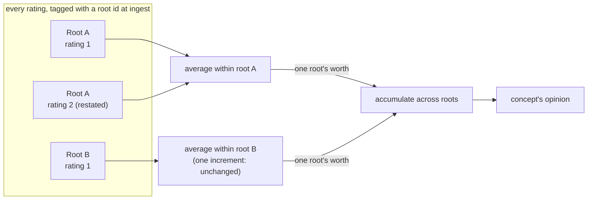

# Fusing evidence

**A belief updates by counting evidence, not by swapping in a new number.** Two counting rules exist: add counts when sources are independent, average them when they are not. Naively adding everything lets one loud source impersonate ten independent ones — the *meme-farm problem*. The app's actual rule is two-tier: tag every rating with the source it came from, average restatements of that one source, then add across distinct sources. It is what keeps a repeated source from counting as a second opinion.

## Two ways to add evidence

Every opinion is stored as two counts: \(r\), evidence *for* the claim, and \(s\), evidence *against* it. (What those counts mean, and how they become a belief/uncertainty number, is in [Opinions and uncertainty](opinions.md).) Fusing two opinions means combining their counts, and there are two honest ways to do it:

| Rule | Formula | Use when | Effect |
|---|---|---|---|
| **Cumulative** | \(r_\diamond = \sum r_i,\; s_\diamond = \sum s_i\) | Sources are independent | Uncertainty keeps falling as evidence piles up |
| **Averaging** | \(r_\diamond = \dfrac{\sum r_i}{N},\; s_\diamond = \dfrac{\sum s_i}{N}\) | Sources are dependent (duplicates, retweets, a shared upstream) | N copies of one opinion count as one |

Cumulative fusion is the right call when each new rating is genuinely new information. Averaging is the right call when it is not — it stops N restatements of one claim from reading as N confirmations.

## The meme-farm problem

Picking the wrong rule by default is dangerous in one direction only. If every rating fused cumulatively, no matter its source, then re-ingesting one edited note three times, or importing one article under two URLs, would each look like three (or two) independent sources agreeing. Settledness — the app's one honesty number — would rise on nothing but repetition. That failure mode is the reason two-tier fusion exists: [the design spec](https://github.com/TheRealBillSiegler/epistemic-pipeline/blob/main/docs/superpowers/specs/2026-06-26-shared-source-root-keyed-fusion-design.md) names it directly and treats it as the bug being fixed, not a hypothetical.

## The two-tier rule

Every evidence increment gets a **root id**: a canonical origin, not a content hash. A root id is a normalized URL, a DOI or arXiv id, or a vault note's stable file path. Editing a note, or fetching the same article from a tracking link and a clean one, produces a new *version* of the same root — never a new root. Example: `notes/ai-risk.md`, edited three times, stays one root id with three versions.

With every increment tagged, the rule runs in two tiers:

1. **Within a root:** average the increments (`fuse_averaging`). Restatements of one source collapse to that source's one opinion.
2. **Across distinct roots:** add the per-root opinions (`fuse_cumulative`). Independent sources still lower uncertainty.

This grouping-by-root rule is not a law of Subjective Logic — it is the project's own duplicate-collapsing convention. Averaging is the safe default when independence is unproven, not proof that the math already knows which ratings are duplicates.

The code names this `two_tier_fuse`, and the replay step that groups the full evidence trail into `(concept, root_id)` buckets before calling it is `aggregate_beliefs` — see [`worldview.py`](https://github.com/TheRealBillSiegler/epistemic-pipeline/blob/main/src/epistemic_pipeline/encodings/worldview.py).

## Worked example

One fully-confident rating contributes \(r=2, s=0\) (the app's evidence-per-document constant). With prior weight \(W=2\), uncertainty is:

$$
u = \frac{W}{r + s + W}
$$

**One root, restated three times.** A note gets reworded and re-ingested three times. All three ratings share a root id, so they average: the mean of three identical \((2, 0)\) opinions is still \((2, 0)\).

$$
u = \frac{2}{2 + 0 + 2} = 0.5
$$

One source's worth of evidence, no matter how many times it repeats.

**Two distinct roots.** Now the same two ratings come from genuinely different sources, A and B. Averaging within each root changes nothing (one increment each), but the per-root opinions now accumulate:

$$
u = \frac{2}{4 + 0 + 2} = \frac{2}{6} \approx 0.33
$$

Uncertainty drops, because a second independent source really did show up. Both numbers — 0.5 for one root, \(2/6\) for two — come straight from [`test_two_tier_fusion.py`](https://github.com/TheRealBillSiegler/epistemic-pipeline/blob/main/tests/encodings/test_two_tier_fusion.py). The same file's next test adds a third distinct root and only checks the direction — uncertainty keeps falling — but the arithmetic above extends cleanly: \(2/8 = 0.25\).

## What this doesn't fix

Root-keying only dedups sources that trace to the *same* canonical origin. Two blogs that both quietly read one press release, without either linking it, sit in the middle: not the same root, but not independent either. Subjective Logic has no operator for that middle ground — the [operator-decisions research](https://github.com/TheRealBillSiegler/epistemic-pipeline/blob/main/docs/research/2026-06-23-sl-operator-decisions-research.md) confirms this is still an open problem in the literature, not a gap specific to this project. The mitigation is procedural, not mathematical: default to averaging whenever independence is unproven, and let near-duplicate content raise a flag that a human, not the algebra, resolves.

!!! warning "Honest status: one shared source root-keying cannot see"
    Every confidence rating in the worldview app comes from one LLM. Its stated number mixes what the document says with the model's own prior belief about the claim. Rate ten documents with that one model, and all ten ratings share that hidden common cause — but the root id only tracks the *document's* origin, not the model that read it. Root-keyed fusion is blind to this by construction. [#35](https://github.com/TheRealBillSiegler/epistemic-pipeline/issues/35) tracks it as open.

## Where next

- What an opinion's counts mean, and how they turn into belief and uncertainty: [Opinions and uncertainty](opinions.md)
- How source reliability discounts evidence before it is fused: [Credibility](credibility.md)
- The full design, including why an EBSL provenance graph was rejected in favor of this: [root-keyed fusion spec](https://github.com/TheRealBillSiegler/epistemic-pipeline/blob/main/docs/superpowers/specs/2026-06-26-shared-source-root-keyed-fusion-design.md)
