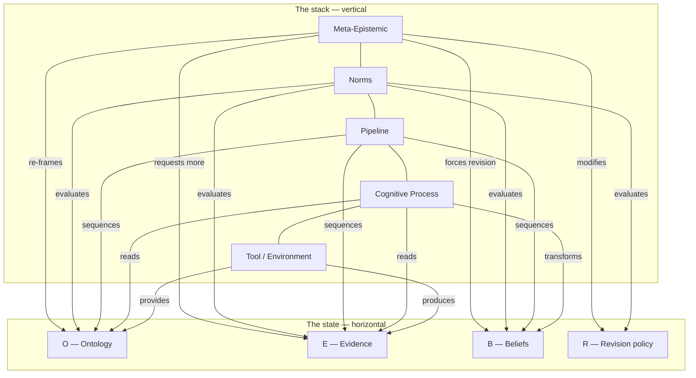

# The five layers

**Every module in this system belongs to one of five layers, and each layer is allowed to touch only some of the `(O, E, B, R)` state.** The stack is the *architecture* — what kind of module runs. The tuple is the *state* — what changes while it runs. They are orthogonal views of one system: the stack is vertical, the tuple is horizontal, and a single reasoning run climbs the first while filling in the second.

## The five layers, bottom to top

Read it bottom to top: work starts at the tools, climbs through reasoning, gets sequenced by the pipeline, gets graded by norms, and gets watched by the meta layer. Read it left to right: each layer's arrows show exactly which state slots it may touch, and how.

### Tool / Environment

*Everything that touches the outside world: LLMs, APIs, databases, simulators, sensors.*

This layer supplies the vocabulary a run can reference — a tool registry becomes part of O — and it produces every observation in E. Nothing counts as evidence until a tool call or an LLM call reports it.

Example: in the LLM-agent encoding, the ontology holds only the tool *names* the agent may call; the callable registry lives on `LLMAgentProblem.tools`. Each tool result is recorded as one `Observation`, tagged `modality="tool"`.

### Cognitive Process

*The reasoning itself: inference, search, memory, heuristics, planning.*

This layer reads O and E and transforms B. It is where a framework's actual math lives — the part that changes when you swap Bayes' rule for a search step.

Example: `bayes_update` reads the ontology's likelihood table and one new observation, then returns updated probabilities. Same interface, different math, and you get a different reasoning framework.

### Pipeline

*The fixed order the six reasoning stages run in, from turning a raw question into a vocabulary to producing a final answer.*

The pipeline sequences O, E, and B through the stage functions without changing their content itself. It never touches R — only the meta layer may modify the revision rule. It composes the stages, collects every intermediate state into a trace, then hands the final state to Norms and Meta.

Example: `run_pipeline` loops over the stage functions, appends each result to the trace, and returns a `PipelineResult`. It contains no reasoning logic of its own — that lives one layer down.

### Norms

*The report card: did the run get the right answer, how much work did it take, can the belief trail be replayed.*

Norms evaluate all four slots — O, E, B, R — but write to none of them. Scoring a run never changes what it believed.

Example: `score_pipeline_run` replays every observation through R, starting from the initial beliefs. If the replay doesn't match the recorded final beliefs, `justification` comes back `False` — proof the trace is honest, not a guess.

### Meta-Epistemic

*The self-monitor: watches the whole run and decides whether to continue, re-frame, switch strategy, or give up.*

Meta is the only layer allowed to change O mid-run. It can re-frame the ontology, request more evidence, force a belief revision, or modify the revision rule itself.

Example: `MetaController.monitor` checks a fixed priority order — budget exhaustion, cycle detection, escalation, reframing, strategy switching — and returns one of `ACCEPT`, `REFRAME`, `SWITCH_STRATEGY`, or `ESCALATE`. An intervention budget (`max_interventions`) stops it from firing forever.

!!! warning "Honest status"
    `REFRAME` is a decision the meta layer can produce, but nothing consumes it yet. A run makes one pass through the stages, then asks the meta controller for its verdict — the answer comes back as a label on `PipelineResult`, not as a new pass through Frame with a wider ontology. [#36](https://github.com/TheRealBillSiegler/epistemic-pipeline/issues/36) tracks the broader gap this falls into: the pipeline doesn't yet enforce what the architecture claims about itself.

## Two orthogonal views

The stack and the tuple answer different questions.

- **The stack (vertical) is architecture.** It asks *what kind of module handles this?* Five layers, bottom to top: tools that touch the world, cognitive processes that reason, a pipeline that sequences stages, norms that grade the run, and a meta layer that watches all of it.
- **The tuple (horizontal) is state.** It asks *what changed?* Four slots — O, E, B, R — hold everything the system knows at one moment. See [the state tuple](state.md) for the full definition.

A single pipeline run moves through both at once. The stack climbs: tools produce evidence, cognitive processes turn it into beliefs, norms grade the result, meta decides what happens next. The tuple accumulates: E grows, B changes, and the trace records every step.

## Where next

- What the four state slots mean and why each invariant holds: [the state tuple](state.md)
- How one run moves through the six stages: [the pipeline](pipeline.md)
- How a framework like Bayes or Subjective Logic plugs into this stack: [encodings](encodings.md)
- Where this layer/state table lives in the primary docs: [README — The Architecture](https://github.com/TheRealBillSiegler/epistemic-pipeline/blob/main/README.md#the-architecture)
