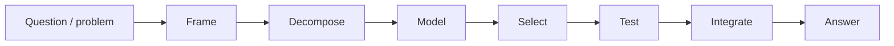

# The pipeline

**One run is six pure functions applied in order, each producing a new frozen state.** Frame builds the vocabulary. Decompose splits the problem. Model sets starting beliefs and the revision rule. Select picks a strategy. Test applies the revision rule to each piece of evidence. Integrate reads the final state and reports an answer. Every state along the way is kept — that list is the trace, and it is what makes a run replayable.

## The six stages

| Stage | What it does |
|---|---|
| **Frame** | Turns the raw question into an ontology (**O**) — the vocabulary the run will reason in. |
| **Decompose** | Splits the problem into sub-problems, if it has any. A no-op for simple problems. |
| **Model** | Sets the starting beliefs (**B**) and picks the revision rule (**R**). |
| **Select** | Chooses a strategy — what evidence to look at, and in what order. |
| **Test** | Applies `R(B, e, O)` once per observation, building up the evidence trail (**E**) one step at a time. This is where most belief changes happen. |
| **Integrate** | Reads the final state and produces an answer. Does not change O, E, B, or R — it only reads them. |

A stage that a framework does not need is not skipped — it is replaced by `identity_stage`, a function that returns the state unchanged. Every encoding that runs the pipeline therefore has the same trace shape: one entry for Frame's output, then one more per later stage, so traces line up across encodings. (The worldview encoding is the exception: its beliefs are built by the store's fusion fold, not by a pipeline run — see the warning below.)

Concretely, the README's Bayesian example diagnoses flu, cold, or covid from symptoms. Frame builds the `BayesOntology` and sets the priors — the starting probabilities before any evidence arrives, here `{flu: 0.4, cold: 0.4, covid: 0.2}`. Decompose, Model, and Select are all `identity_stage` — Bayes' rule needs no sub-problems, and Frame already set the beliefs, the revision rule, and the evidence order. Test applies Bayes' rule once per symptom, so observing `loss_of_smell = "yes"` swings the posterior — the probabilities after the evidence — toward covid. Integrate is `identity_stage` too, because the posterior distribution already is the answer.

## The trace

Every state the six stages produce is kept, in order, in `PipelineResult.trace`. Nothing is overwritten. That list is the complete history of one run: what was believed after Frame, after Decompose, and so on through Integrate.

`dump_trace` writes that list to a JSONL file — one JSON object per line, so each line is small enough to grep and the whole file is a plain text log. The first line is a header naming the encoding (`bayes`, `strips`, `mdp`, `llm_agent`, or `worldview`) and the schema version. Every line after that is one state: its ontology, its evidence, its beliefs, its metadata.

The revision rule **R** is not written to the file — a Python function is not JSON. Instead, `load_trace` looks up the encoding name from the header in a registry and reattaches that encoding's current revision function. Ontology and beliefs, by contrast, are plain data, so they serialize directly.

`epc replay <trace.jsonl>` rebuilds a run from that file. It starts from the beliefs in the first state, then walks the final state's evidence list one observation at a time, reapplying the revision rule after each one and printing the belief change. `epc diff` compares two trace files and reports the first step where they disagree. `epc score` grades a trace against the epistemic norms: reliability, calibration, efficiency, justification, power.

Round-trip tests (`tests/test_trace.py`, `tests/test_worldview.py`) check that dumping a trace and loading it back gives the same evidence, beliefs, and ontology for every encoding — that is how determinism is tested, not just claimed.

!!! warning "Honest status: replay uses today's revision rule, not the one that made the trace"
    `load_trace` reattaches whichever revision function the *current* code maps to the trace's encoding name. If that rule has changed since the trace was recorded, replay silently uses the new rule — the file never records which version of R actually produced it. For the worldview encoding this is a live discrepancy: the store applies a root-keyed, two-tier fusion, but the registered `worldview_update` used by replay still folds every observation cumulatively, so replaying a stored trace can reproduce a bug the store path already fixed.
    [#30](https://github.com/TheRealBillSiegler/epistemic-pipeline/issues/30) tracks recording R's identity in the trace header and checking it on load.

## Where next

- What the trace is preserving: [the state tuple](state.md)
- Who runs each stage: [the five layers](layers.md)
- The formal definition: [v1.1 design spec](https://github.com/TheRealBillSiegler/epistemic-pipeline/blob/main/docs/superpowers/specs/2026-05-14-epistemic-pipeline-v11-design.md)
