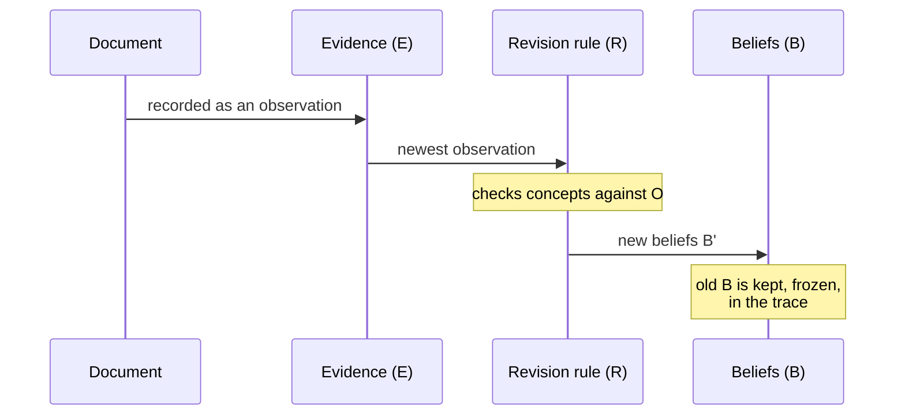

# The state tuple

**Everything the system knows at any moment fits in four slots: `(O, E, B, R)`.** O is the vocabulary, E is the record of what was seen, B is what is currently believed, and R is the rule for changing B. Each pipeline step produces a new, frozen copy of this state. The old copies are never edited — they become the audit trail.

## The four components

### O — Ontology

*The set of concepts the system can hold beliefs about.*

If a concept is not in O, no evidence about it can move a belief. For a medical diagnosis run, O might be `{flu, cold, covid}`. For the worldview app, O is the set of claims seen so far — it grows as documents arrive.

O is **static within a pipeline run**. Re-framing the problem — adding or replacing concepts mid-reasoning — is reserved for the meta layer, because changing the vocabulary mid-argument is a bigger epistemic act than updating a belief.

### E — Evidence

*The append-only list of observations.*

Each observation records what was seen, where it came from, when, and with what stated confidence. Example: *"the LLM rated claim X at 0.9, from document Y, at time T."*

E is **append-only**. Evidence can be outweighed by later evidence, but it can never be unseen. Deleting evidence would break the one question the system exists to answer: *why does it believe this?*

### B — Beliefs

*What the system currently holds, and how strongly.*

The shape of B depends on the encoding: a probability distribution for Bayes, a set of facts for STRIPS planning, a [Subjective Logic opinion](../beliefs/opinions.md) per claim for the worldview app.

### R — Revision policy

*The pure function that turns old beliefs plus one observation into new beliefs.*

$$
R(B, e, O) \rightarrow B'
$$

R is **pure and deterministic**: same inputs, same output, no side effects. This is the load-bearing constraint. Because R is the *only* way beliefs change, and R is replayable, the whole belief history is replayable.

## One update, step by step

Concretely, in the worldview app: a note is saved → the LLM's rating of its claims is appended to E → R fuses that rating into each claim's opinion → the new B is stored, and the old one stays in the trace.

## The invariants

These rules hold at every step. They are what the architecture *is* — break one and the audit trail stops meaning anything.

| Invariant | Plain statement | Why it matters |
|---|---|---|
| State is immutable | Each step makes a new state; old ones are never edited | History cannot be rewritten |
| E is append-only | Evidence is never deleted | "Why?" always has an answer |
| O is static per run | Only the meta layer re-frames | Vocabulary changes are deliberate, visible acts |
| R is pure | `R(B, e, O)` has no side effects | Replay rebuilds the same beliefs |
| The trace is kept | Every intermediate state is preserved | Any past belief can be inspected |

!!! warning "Honest status"
    Today these invariants are enforced by convention and tests, not by the pipeline itself —
    a stage *could* violate them without being caught.
    [#36](https://github.com/TheRealBillSiegler/epistemic-pipeline/issues/36) tracks making the
    pipeline check them at every step.

## Where next

- How the layers of the system divide this state between them: [The five layers](layers.md)
- How a full run flows through six stages: [The pipeline](pipeline.md)
- The formal definition: [v1.1 design spec](https://github.com/TheRealBillSiegler/epistemic-pipeline/blob/main/docs/superpowers/specs/2026-05-14-epistemic-pipeline-v11-design.md)
