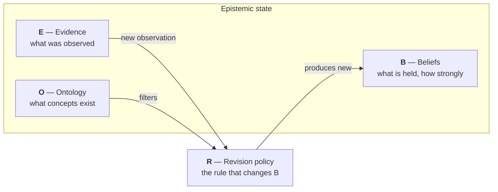

# Epistemic Pipeline

**A reasoning system that shows its work.** It reads evidence, updates beliefs by explicit rules, and keeps a replayable record of every change. You can always ask: *what did it believe, when, and why?* — and get a checkable answer.

## The whole idea in one diagram

Every piece of the system reads or writes one of four things. Together they are the **epistemic state**.

A document arrives. It becomes evidence (**E**). The revision rule (**R**) reads that evidence, checks it against the known concepts (**O**), and produces new beliefs (**B**). Nothing else may change beliefs. That single constraint is what makes the system auditable: the belief trail has no side doors.

## Why this exists

Most AI systems give you a conclusion and a vibe of confidence. This project takes the opposite bet: the *process* can be honest even when no system can promise *truth*. So every number on screen is computed by rules you can read, from evidence you can inspect, in an order you can replay.

Three commitments follow from that:

1. **Every belief traces to evidence.** No belief moves without a recorded observation behind it.
2. **Replay gives the same answer.** The same evidence, in the same order, rebuilds the same beliefs. Determinism is tested, not promised.
3. **The numbers never claim more than they mean.** "How settled is this belief" measures recorded, deduplicated evidence — not truth. The [honesty page](worldview/honesty.md) spells out exactly where the limits are.

## Where to go

- **[Core ideas](concepts/index.md)**

    The state tuple, the five layers, the pipeline, and the encodings. Start here.

- **[Beliefs as numbers](beliefs/index.md)**

    How a belief becomes arithmetic: opinions, uncertainty, evidence fusion, credibility.

- **[The worldview app](worldview/index.md)**

    The first application: drop in documents, watch beliefs update, audit every move.

- **[Project status](project/status.md)**

    What is built, what is measured, what is deferred — with links to the open issues.

!!! note "Reading the docs vs. reading the specs"
    These pages explain. The formal design lives in the
    [specs](https://github.com/TheRealBillSiegler/epistemic-pipeline/tree/main/docs/superpowers/specs),
    which stay the source of truth. When a page here summarizes a spec, it links to it.
