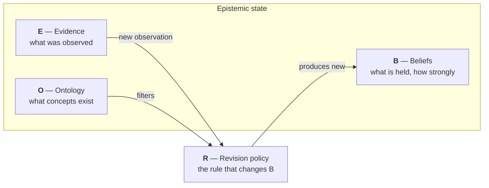

# Epistemic Pipeline

Pick something you believe today that you did not believe five years ago. Naming the belief is easy. Now try to name what changed it — which article, which conversation, which study — and whether that evidence deserved the weight you gave it.

Almost nobody can. Beliefs change off the books: you read, something shifts, the source fades, and what remains is confidence with no memory of where it came from. The AI systems now doing more of our reading have the same defect at higher speed — a conclusion, a tone of confidence, and no ledger behind either.

The Epistemic Pipeline is the ledger. Evidence goes in, beliefs change by an explicit rule, and every change is recorded — so *why do I believe this?* always has a checkable answer.

## Watching the ledger work

Say you have a standing question and documents arrive over time. One claim inside them: *"GLP-1 drugs reduce cardiovascular risk."*

1. **The first document** rates the claim at 0.8. Belief moves from 0.50 (no evidence — the default coin-flip) to **0.65**. Not to 0.8: one source leaves half the picture unknown, and the math says so.
2. **A second, independent document** agrees. Belief moves to **0.70**, and the recorded uncertainty drops — a real second source showed up.
3. **You re-save the second document after fixing a typo.** Belief stays **0.70**. Same source again is repetition, not new evidence, and repetition moves nothing.
4. **You ask why it sits at 0.70.** The answer is not a shrug: it is the two documents, their timestamps, the exact rule that combined them, and a replay that reproduces the number from scratch.

That is the whole product idea: beliefs that are *earned* from recorded evidence, immune to repetition, and always able to show their work. The [worldview app](worldview/index.md) is this flow over your own documents.

## The whole idea in one diagram

Every piece of the system reads or writes one of four things. Together they are the **epistemic state**.

A document arrives. It becomes evidence (**E**). The revision rule (**R**) reads that evidence, checks it against the known concepts (**O**), and produces new beliefs (**B**). Nothing else may change beliefs. That single constraint is what makes the system auditable: the belief trail has no side doors.

The worldview app is the first application, not the whole idea. The same four slots hold Bayesian inference, classical planning, and graph search — [any reasoning that follows rules](concepts/encodings.md) can run on this pipeline and inherit the same auditability. The deeper project is making epistemological process itself executable: not just *what* to believe, but a checkable record of *how* believing happened.

## Why this exists

Most AI systems give you a conclusion and a vibe of confidence. This project takes the opposite bet: the *process* can be honest even when no system can promise *truth*. Three commitments follow:

1. **Every belief traces to evidence.** No belief moves without a recorded observation behind it.
2. **Replay gives the same answer.** The same evidence, in the same order, rebuilds the same beliefs. Determinism is tested, not promised.
3. **The numbers never claim more than they mean.** "How settled is this belief" measures recorded, deduplicated evidence — not truth. The [honesty page](worldview/honesty.md) spells out exactly where the limits are.

## Beyond your documents

The same machinery points at a bigger target: the model itself. An LLM's own knowledge can be broken into claims and tracked the same way — with the model as a single evidence root, so asking it twice never counts as two sources, and its prior on every claim declared up front instead of hidden. That would make what a model believes auditable, diffable across versions, and retractable with a receipt. A literature sweep found no existing system that combines these pieces. None of it is built yet; all of it is [designed and researched](project/directions.md), with the prerequisites named.

## Who this is for, today

Honest answer: today the tool is a **Python library plus this documentation**. If you can run a Python snippet, you can drive the full flow above. A local server and browser UI ([#9](https://github.com/TheRealBillSiegler/epistemic-pipeline/issues/9)) and a paste-and-run quickstart ([#10](https://github.com/TheRealBillSiegler/epistemic-pipeline/issues/10)) are open work — until they land, note-tool users without Python have no surface to operate yet. The docs are written for both audiences: what the system does, and exactly where it stops.

## Where to go

- **[Core ideas](concepts/index.md)**

    The state tuple, the five layers, the pipeline, and the encodings. Start here for the architecture.

- **[Beliefs as numbers](beliefs/index.md)**

    How a belief becomes arithmetic: opinions, uncertainty, evidence fusion, credibility.

- **[The worldview app](worldview/index.md)**

    The first application: drop in documents, watch beliefs update, audit every move.

- **[Project status](project/status.md)**

    What is built, what is measured, what is deferred — with links to the open issues.

- **[Directions](project/directions.md)**

    Where this goes: auditing a model's own knowledge, retraction with receipts, and the measurements that gate everything.

!!! note "Reading the docs vs. reading the specs"
    These pages explain. The formal design lives in the
    [specs](https://github.com/TheRealBillSiegler/epistemic-pipeline/tree/main/docs/superpowers/specs),
    which stay the source of truth. When a page here summarizes a spec, it links to it.
