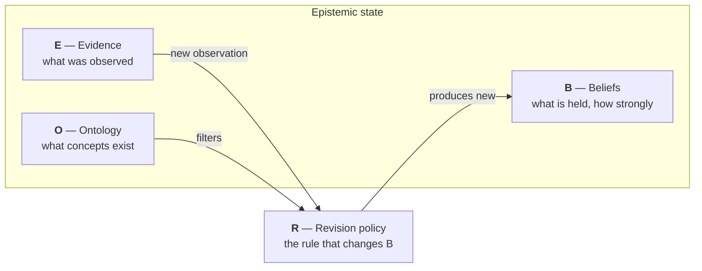

# Epistemic Pipeline

**You read constantly — papers, articles, notes. Each one nudges what you believe. But nothing keeps score.** A month later you are confident about a claim and cannot say which sources made you confident, whether those sources were truly independent, or why the confidence is what it is. Your beliefs have no receipts.

This project builds the receipts. It is a reasoning system that reads evidence, updates beliefs by explicit rules, and keeps a replayable record of every change. You can always ask: *what did it believe, when, and why?* — and get a checkable answer.

## What using it looks like

Say you have a standing question and documents arrive over time. One claim inside them: *"GLP-1 drugs reduce cardiovascular risk."*

1. **The first document** rates the claim at 0.8. Belief moves from 0.50 (no evidence — the default coin-flip) to **0.65**. Not to 0.8: one source leaves half the picture unknown, and the math says so.
2. **A second, independent document** agrees. Belief moves to **0.70**, and the recorded uncertainty drops — a real second source showed up.
3. **You re-save the second document after fixing a typo.** Belief stays **0.70**. Same source again is repetition, not new evidence, and repetition moves nothing.
4. **You ask why it sits at 0.70.** The answer is not a shrug: it is the two documents, their timestamps, the exact rule that combined them, and a replay that reproduces the number from scratch.

That is the whole product idea: beliefs that are *earned* from recorded evidence, immune to repetition, and always able to show their work. The [worldview app](worldview/index.md) is this flow over your own documents.

## The whole idea in one diagram

Every piece of the system reads or writes one of four things. Together they are the **epistemic state**.

A document arrives. It becomes evidence (**E**). The revision rule (**R**) reads that evidence, checks it against the known concepts (**O**), and produces new beliefs (**B**). Nothing else may change beliefs. That single constraint is what makes the system auditable: the belief trail has no side doors.

## Why this exists

Most AI systems give you a conclusion and a vibe of confidence. This project takes the opposite bet: the *process* can be honest even when no system can promise *truth*. Three commitments follow:

1. **Every belief traces to evidence.** No belief moves without a recorded observation behind it.
2. **Replay gives the same answer.** The same evidence, in the same order, rebuilds the same beliefs. Determinism is tested, not promised.
3. **The numbers never claim more than they mean.** "How settled is this belief" measures recorded, deduplicated evidence — not truth. The [honesty page](worldview/honesty.md) spells out exactly where the limits are.

## Who this is for, today

Honest answer: today the tool is a **Python library plus this documentation**. If you can run a Python snippet, you can drive the full flow above. A local server and browser UI ([#9](https://github.com/TheRealBillSiegler/epistemic-pipeline/issues/9)) and a paste-and-run quickstart ([#10](https://github.com/TheRealBillSiegler/epistemic-pipeline/issues/10)) are open work — until they land, note-tool users without Python have no surface to operate yet. The docs are written for both audiences: what the system does, and exactly where it stops.

## Where to go

- **[Core ideas](concepts/index.md)**

    The state tuple, the five layers, the pipeline, and the encodings. Start here for the architecture.

- **[Beliefs as numbers](beliefs/index.md)**

    How a belief becomes arithmetic: opinions, uncertainty, evidence fusion, credibility.

- **[The worldview app](worldview/index.md)**

    The first application: drop in documents, watch beliefs update, audit every move.

- **[Project status](project/status.md)**

    What is built, what is measured, what is deferred — with links to the open issues.

!!! note "Reading the docs vs. reading the specs"
    These pages explain. The formal design lives in the
    [specs](https://github.com/TheRealBillSiegler/epistemic-pipeline/tree/main/docs/superpowers/specs),
    which stay the source of truth. When a page here summarizes a spec, it links to it.
