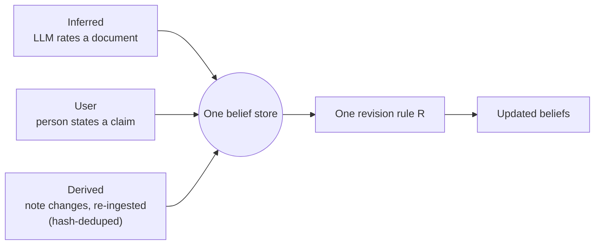

# The worldview app

**Drop in a document. The app rates the claims in it, folds that rating into your existing beliefs by one fixed rule, and keeps every move so you can check it later.** No conclusion is ever just asserted — each number traces back to the evidence and the rule that produced it.

## What it does

You give the app a document, or state a claim yourself, or point it at a folder of notes. It keeps one running set of beliefs — an [opinion](../beliefs/index.md) per claim, in the [Subjective Logic](https://github.com/TheRealBillSiegler/epistemic-pipeline/blob/main/docs/superpowers/specs/2026-06-23-worldview-subjective-logic-design.md) sense: how much evidence supports the claim, how much contradicts it, and how much is still unknown. New evidence never overwrites the old — it accumulates. The design also weights evidence by source credibility, but that weighting is currently switched off and labeled as such (see [What the numbers mean](honesty.md)). The [revision rule](../concepts/state.md#r-revision-policy) that does the folding is the same `R` from the state tuple: pure, deterministic, replayable.

## Three ways a belief enters the store

All three paths write to the same [belief store](store.md) and go through the same revision rule. They differ only in *where the rating comes from*.

- **Inferred** — an LLM reads a document and rates the claims in it, one confidence per claim. This is the default path: paste in an article, get back ratings.
- **User** — a person states a claim and a confidence directly. No document, no LLM call — you assert it yourself.
- **Derived** — a note gets re-rated whenever it changes. The ingester hashes the note's content; if the hash matches the last ingest, nothing runs. This stops one unedited save from being counted as new evidence twice. (You wire it to your own file watcher — the app does not watch files itself.)

A claim's id is its own text — the sentence *is* the claim, like `"Fiscal Q4 2024 = $2.1B"`. That is why all three paths can update the *same* claim: if a document later rates a claim you authored yourself, the document's rating takes over, and the change is recorded as a drift event, not a silent overwrite.

## The first-upload invariant

A brand-new install has an empty belief store — no claims, no history. Drop in one document, and the app still produces a meaningful result. There is no setup step and no minimum corpus size.

This works because an empty prior carries no information: with zero accumulated evidence, a claim's uncertainty starts at its maximum (1.0, total ignorance) and its projected probability sits at the base rate (0.5 by default). The first document's evidence is not competing against anything, so it simply becomes the belief. The evidence speaks alone.

!!! note "Why this matters"
    Most belief-revision demos need a seeded corpus to look interesting. This one is designed so the *first* document already exercises the real math — same revision rule, same trace, same guarantees as document one thousand.

## Status

The belief store, the Subjective Logic encoding, and all three ingestion paths are built and tested. What's open:

- **The server and browser UI** ([#9](https://github.com/TheRealBillSiegler/epistemic-pipeline/issues/9)) — right now the app is a library you drive from Python. A local server and a UI for the before/after panel, conflict surfacing, and the belief-drift timeline are not built yet.
- **README and demo copy** ([#10](https://github.com/TheRealBillSiegler/epistemic-pipeline/issues/10)) — a quickstart with a seed corpus, one per ingestion path, is not written yet.

## Where next

- **[The belief store](store.md)** — what gets persisted, and how the drift timeline is reconstructed from it.
- **[What the numbers mean](honesty.md)** — how far you can trust a projected probability, and where the honesty limits are.
- **[Beliefs as numbers](../beliefs/index.md)** — the Subjective Logic math behind an opinion, without the app layer on top.
