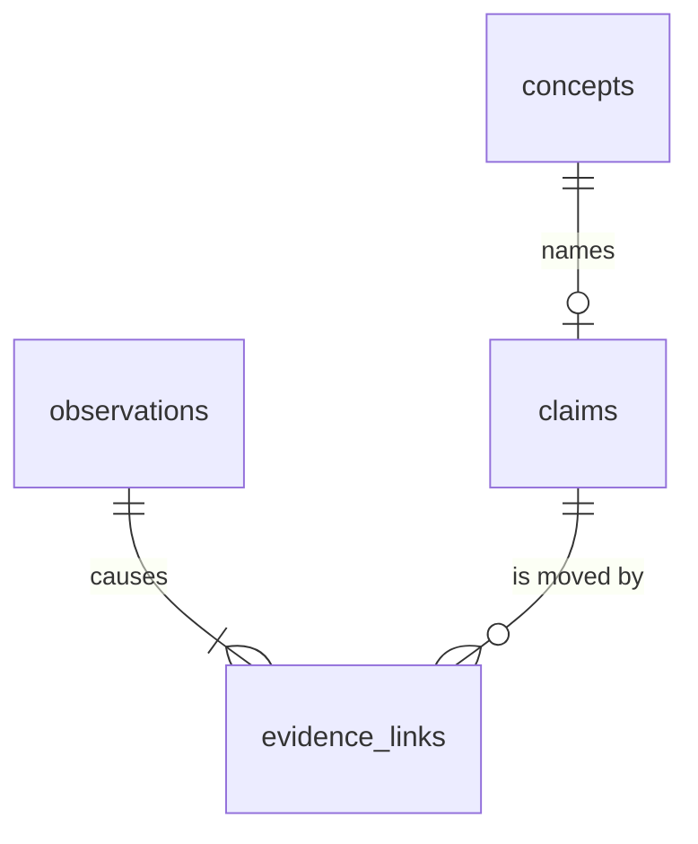

# The belief store

**Four SQLite tables hold everything the worldview app knows: `claims` is the current archive, `observations` is the evidence trail, `concepts` is the ontology, and `evidence_links` records which observation moved which claim — replay those links in order and you get the drift timeline for free.** Nothing here is exotic. It is deliberately boring, so that the audit trail is just a SQL query away.

## The four tables

**`claims`** is the belief archive B, one row per claim, keyed by the claim's own text. A new rating overwrites the row in place — `put_claim` is an upsert. This is a high-water archive, not a normalized distribution: a claim's `confidence` is the last value written for it, and across many documents the confidences in this table can sum past 1.0.

**`observations`** is the evidence E. It is append-only: `add_observation` only inserts, never updates. Each row is one rating event — a variable, a value, a source, a stated confidence, a timestamp.

**`concepts`** is the ontology O. It is an append-only set of names: `add_concept` uses `INSERT OR IGNORE`, so the first write wins and re-adding a known concept is a no-op. `ingest_document` registers every claim it rates as a concept before revision runs, so O grows with the documents fed in.

**`evidence_links`** records what moved what. Each row is one observation's effect on one claim: the `delta` in confidence, a `reason` string, and a timestamp. This table is also the drift timeline — see below.

There is no fifth table for full-trace replay. Trace files are JSONL, handled by `trace.py`. Mixing that into the SQL schema would tangle two different concerns — the current archive and the full replay log — into one table.

## The drift timeline

A claim's history is just its `evidence_links` rows, ordered by time. `Store.history(claim_id)` returns them in that order, so "how did this belief get here" is a single query, not a reconstruction.

The timeline reconstructs as **a starting value plus cumulative deltas**. `ingest_rating` computes each delta by reading the claim's currently cached `confidence` (`p_before`), fusing in the new rating to get the post-fusion projected probability (`p_after`), then writing `p_after - p_before` as the link's delta. A brand-new claim has no cached row yet, so `p_before` falls back to the base rate, 0.5.

Authored claims appear in the timeline too, even though they carry no Subjective Logic evidence behind them. `author_claim` writes the claim row plus an audit-only record of the change ([PR #38](https://github.com/TheRealBillSiegler/epistemic-pipeline/pull/38)) — a person stating a confidence, not a document being rated — and it stays outside belief fusion. If a document later rates that same claim text, the two collide on id: the document's projected probability becomes the new `confidence`, and the link's delta is measured from whatever the user last saw, not from a fictitious evidence-only starting point. The displayed number always drifts continuously, even at the seam between a human assertion and a machine rating.

## Provenance: knowing where evidence came from

Two records that trace back to the same source must not be counted twice. `canonicalize_origin` (in `provenance.py`) turns a raw origin — a URL, a DOI, a vault path — into a stable `root_id`. `https://Blog.com/x?utm_source=tw&id=7#frag` and `https://blog.com/x?id=7` both canonicalize to the same root: the fragment and tracking parameters are dropped, `http`/`https` and a leading `www.` are folded together, `doi:`/`arxiv:` prefixes are normalized, and an arXiv version suffix (`v1`, `v2`, …) is stripped because a new version is not a new source.

`ingest_document` resolves the caller's `origin` through this function before it ever reaches the store, so re-importing one article twice does not inflate how settled its claims look. Belief fusion (the two-tier `aggregate_beliefs`) groups ratings by `root_id`: repeats of one root are averaged, not summed, while distinct roots accumulate.

An observation's `source` column records who made the rating: `model_id@prompt_hash#seed` — for example `gpt-4@a1b2c3d4e5f6#7`. `prompt_hash` is a hash of everything the LLM saw (question, known concepts, document text), so two prompts that differ only in which concepts were already known do not collide into one provenance record. This is a different axis from `root_id`: `source` says which model call produced the rating, `root_id` says which real-world document it came from.

## The cost of an honest trail

!!! warning "Honest status"
    `ingest_rating` re-fuses the *entire* observation trail for a concept on every write (`aggregate_beliefs` walks every stored rating each time), so one ingest costs O(n) in the number of observations already recorded. That is fine at personal-corpus scale — hundreds to low thousands of documents — but it will not scale to a shared, high-volume archive without an incremental fusion path.

## Where next

- What the numbers coming out of this store actually mean: [What the numbers mean](honesty.md)
- The Subjective Logic math behind fusion: [Fusing evidence](../beliefs/fusion.md)
- The store's role in the state tuple: [The state tuple](../concepts/state.md)
